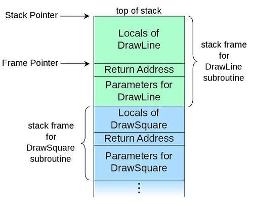

# Algorithm
## 220817 220818 stack, dp, dfs
### 목표
* 알고리즘 문제 풀이 방법 익히기
* stack 구현 및 문제 풀이
* dfs 구현 및 문제 풀이


### stack
* LIFO Last In First Out
* 후입선출의 자료구조
* 스택의 자료는 선형 구조
  * 선형 구조 : 자료간의 관계가 1대1
  * 비선형 구조 : 자료간의 관계가 1대N ex) graph, tree

#### 구현
* top : 스택에 가장 최근에 추가된 원소의 위치
  * stack pointer 라고도 함
* push : 원소 추가
* pop : top의 원소 반환 후 제거 (꺼내기)
* isEmpty : 공백 확인
* peek : top의 원소 반환

```python
# append, pop 으로 구현
def push(item):
    stack.append(item)

def pop():
    if len(stack) == 0: print('underflow')
    else: return stack.pop(-1)

stack = []
```
```python
# size고정 밑 index로 구현
def push(item, size):
    global top
    top += 1
    if top == size: print('overflow') # overflow
    else: stack[top] = item

def pop():
    global top
    if top == -1: print('underflow')
    else:
        top = -1
        return stack[top+1]

size = 10
stack = [0]*size
top = -1
push(10, size)
```
```python
class Stack:
    def __init__(self, size):
        self.top = -1
        self.size = size
        self.stack = [0]*size
    
    def push(self, item):
        self.top += 1
        if self.top == self.size: return -1 # overflow
        else: self.stack[self.top] = item

    def pop(self):
        if self.top == -1: return -1 # underflow
        else: 
            self.top -= 1
            return self.stack[self.top+1]

    def isEmpty(self):
        print(1) if self.top == -1 else print(0)

    def peek(self):
        return -1 if self.top == -1 else self.stack[self.top]

size = 10
s = Stack(size)

s.push(10)
s.push(24)
s.push(-4)
s.isEmpty()

print(s.pop())
print(s.pop())
print(s.peek())
print(s.pop())
print(s.peek())
s.isEmpty()
```
* append는 데이터가 많아지면 속도가 느림
* 변수 top을 인덱스로 사용시 indexError 주의
* 1차원 array로 구현할 경우
  * 구현이 쉬움
  * 스택의 크기가 고정되는 단점 (c언어 배열 크기 고정)
* linked list로 구현
  * 동적 할당으로 스택 구현
  * 스택 크기 고정 해결
  * 구현이 복잡
  * 메모리를 효율적으로 사용

#### 괄호 문제
* stack의 대표적인 문제
* 괄호 관련 문제이면 stack으로 접근
* 예외 케이스 잘 생각해보기
* [boj 9012](https://www.acmicpc.net/problem/9012)

### function call

* 프로그래밍에서 함수 호출은 stack 자료 구조를 활용
* 가장 마지막에 호출된 함수가, 가장 먼저 실행 LIFO
* 함수 호출이 발생하면,
  * 함수에 필요한 지역변수, 매개변수, 복귀할 주소...
  * 등의 정보를 stack frame에 저장하여 system stack에 삽입
* 함수 실행이 끝나면,
  * system stack의 top을 pop하면서 복귀할 주소를 읽고 복귀

### 재귀 호출
* 자기 자신을(재귀) 호출하여 순환 수행
* 재귀를 사용하여 코드를 간단하게 작성 가능
* 함수가 중복해서 호출되어 속도가 느리고 메모리 사용이 비효율적
* ex) 피보나치 수열
```python
# recursion
def fibo(a):
    if a == 1 or a == 2:
        return 1
    else:
        return fibo(a-1) + fibo(a-2)

# print(fibo(100))
```

### memoization
* top-down
* recursive
* 이전에 계산한 값을 메모리에 저장하여, 
* 다음에 중복 계산하지 않고 메모리에서 값을 불러와 실행 속도를 높이는 방법
* ex) 피보나치 수열
```python
# top-down memoization
d = [0]*101

def fibo(a):
    if a == 1 or a == 2:
        return 1

    if d[a] != 0:
        return d[a]

    d[a] = fibo(a-1) + fibo(a-2)
    return d[a]

print(fibo(100))
```

### tabulation
* bottom-down
* iterative
```python
# bottom-up tabulation
d = [0]*101

d[1] = 1
d[2] = 1

n = 100
for i in range(3, n+1):
    d[i] = d[i-1] + d[i-2]

print(d[n])
```

### DP Dynamic Programming 동적 계획법
* **최적화 문제**를 해결하는 알고리즘
* 작은 문제들을 해결한 후에, 그 해를 이용하여 큰 문제들을 해결하는 알고리즘

#### dp 문제 특징
  * 최적 부분 구조
  * 부분 문제 중복

#### 풀이 순서
  1. 문제를 부분 문제로 분할
  2. 가장 작은 부분문제부터 해결
  3. 결과를 테이블에 저장
  4. 테이블을 이용하여 상위 문제 해결

#### 구현 방식
* top-dwon memoization : recursive 방식
* botoom-up tabulation : iterative 방식
* bottom-up이 효율적이고 보편적으로 사용
* 재귀적 방식은 시스템 호출 스택을 사용하는 오버헤드 발생
  * 코드를 짤 때, **함수가 반복적으로 호출되는 구조는 피하는 것**이 좋다


### graph
* graph
  * 비선형 자료 구조
  * graph같은 자료 구조를 검색하는 방법
* DFS 
  * Depth First Search 
  * 깊이 우선 탐색
  * stack과도 연관
* BFS
  * Breadth First Search
  * 너비 우선 탐색

### graph
* graph 저장 방법
* adjlist
* adjmatrix
```python
# node 7개, edge 8개
# node -> node 경로 정보를 담은 list
graph = [1, 2, 1, 3, 2, 4, 2, 5, 4, 6, 5, 6, 6, 7, 3, 7]
# 인접 배열
adj_list = [[], [2, 3], [4, 5], [7], [6], [6], [7], []]
# 인접 행렬
adj_matrix [
    [0, 0, 0, 0, 0, 0, 0, 0],
    [0, 0, 1, 1, 0, 0, 0, 0],
    [0, 0, 0, 0, 1, 1, 0, 0],
    [0, 0, 0, 0, 0, 0, 0, 1],
    [0, 0, 0, 0, 0, 0, 1, 0],
    [0, 0, 0, 0, 0, 0, 1, 0],
    [0, 0, 0, 0, 0, 0, 0, 1],
    [0, 0, 0, 0, 0, 0, 0, 0]
    ]
# 단방향 sparse
```

>코테 기본 (매우 중요)
### DFS Depth First Search 깊이우선탐색
* 시작 node에서 한 방향으로 갈 수 있는 경로 끝까지 깊이 탐색
* 더 이상 갈 수 없으면, 가장 최근 노드의 갈림길에서 다른 방향으로 깊이 탐색
* 위를 반복하여 모든 노드 방문하며 순회
* 가장 최근 노드를 방문하여 다른 엣지로 가야하므로 
* LIFO **stack 자료 구조 사용**
* 방문 순서는 상황에 맞게 적용
    * 자료 구조에 저장된 순서
    * 빠른 번호
    * 큰 번호

#### 구현
1. 시작 node v를 결정하여 방문
2. v의 인접 node 중
3. 방문하지 않는 node w가 존재하면
   1. node v를 stack에 push
   2. node w 방문
   3. w를 v로 update하여 2.반복
4. 모든 node를 방문하였으면 (node w가 존재x)
   1. stack을 pop
   2. 가장 최근 방문한 node를 v로 update하여 2. 반복
5. stack이 빌 때까지 반복
>pseudo code
```python
visited[], stack[] 초기화
DFS(v)
    시작점 v 방문
    visited[v] <- true
    while
        if v의 인접 node중 방문 안한 w가 존재
            push(v)
            v <- w
            visited[w] <- true
        else
            if 스택안에 원소가 있으면
                v <- pop(stack)
            else
                break
```
* graph에서 인접 node 정보를 나타내는 graph 배열 필요
* 방문 정보를 나타내는 visited 배열 필요, T/F 나 0/1로 표시
* 최근 node를 저장하는 stack 배열 필요
>재귀 함수 사용
```python
def dfs(now):
    # 1. 방문 표시
    visited[now] = 1
    result.append(now)
    # 2. 인접 정점 확인
    for nxt in range(N+1):
        if graph[now][nxt] == 1 and visited[nxt] == 0:
            # 3. 이동가능하다면 이동
            dfs(nxt)

visited = [0] * (N+1)
graph = [[0] * (N+1) for _ in range(N+1)] # graph 정보
for i in range(E): # 인접 행렬 만들기
    graph[lst[i*2]][lst[i*2+1]] = 1
    graph[lst[i*2+1]][lst[i*2]] = 1 # 양방향일 경우

result = []
start = 1
dfs(start)
print(*result)
```
>stack 사용
```python
def dfs(now):
stack = [now]
while stack:
    # 1. 방문 표시
    visited[now] = 1
    # 2. 인접 정점 확인
    for nxt in range(N+1):
        # 3. 이전에 방문했던 곳인지 확인
        if graph[now][nxt] == 1 and visited[nxt] == 0:
            # 4. 안했다면 방문하여 stack에 push
            stack.append(now)
            now = nxt
            result.append(nxt)
            break
    # 5. 인접 정점의 방문이 끝나면 stack에서 pop, 이전 최근 정점에서 1. 반복
    else:
        now = stack.pop()

visited = [0]*(N+1)
graph = [[0]*(N+1) for _ in range(N+1)] # graph 정보
for i in range(E): # 인접 행렬 만들기
    graph[lst[i*2]][lst[i*2+1]] = 1
    graph[lst[i*2+1]][lst[i*2]] = 1 # 양방향일 경우

start = 1
result = [start]
dfs(start)
print(*result)
```