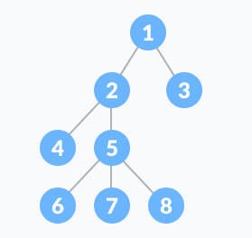
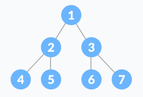
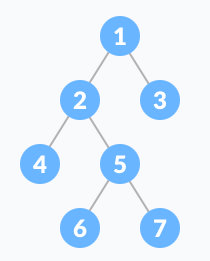
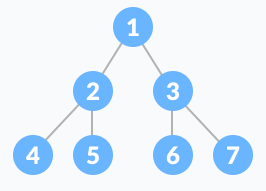
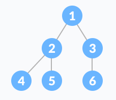
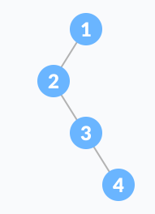
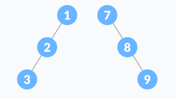
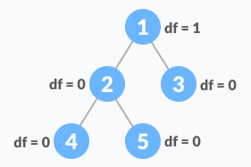
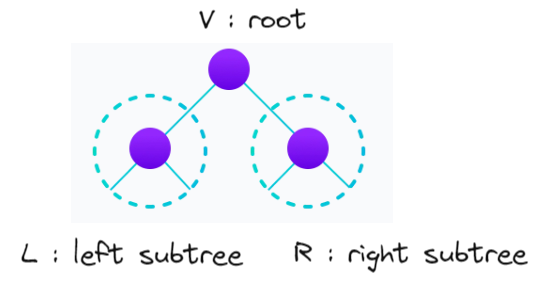
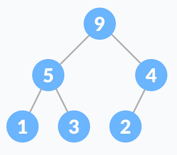

# Algorithm
## 220913 tree
### 목표
* 알고리즘 문제 풀이 방법 익히기
* tree 문제 풀이 방법 익히기


### tree 트리

* 원소들 간에 상하 계층관계를 가지는 계층형 자료구조
* 비선형 구조
  * 자료간의 관계가 1:N
* 상위에서 하위로 확장되는 트리 모양
* 1개 이상의 노드로 이루어진 유한 집합
* node와 edge로 구성

#### 용어
* root : 최상위 노드
* leaf node : 최하위 노드
  * 0 degree인 노드
  * 자식 노드가 없는 노드
* parent : 부모
* child : 자식
* sibling : 형제
* ancester : edge를 따라 root까지의 경로에 있는 모든 node들
* descendant : subtree에 있는 모든 하위 node들
* subtree : 노드 하위에 정의되는 트리
* degree : 차수 
  * 노드의 차수 : 자식 노드의 수
  * 트리의 차수 : 트리의 노드의 차수 중 가장 큰 값
* level : 레벨
  * root level은 0 (정의 따라 1일수도 있음)
* height : 높이
  * 노드의 높이 : 루트에서 노드까지의 간선 수, 노드 level
  * 트리의 높이 : 트리의 노드의 높이 중 가장 큰 값, max level

### binary tree 이진트리

* 모든 노드들이 2개의 서브트리를 가지는 형태
* 자식 노드의 최대 개수가 2개
* 레벨 i의 최대 노드 개수는 2^i개
* 높이 h의 이진트리의 최소 노드 개수는 h+1, 최대 노드 개수는 2^(h+1)-1 개

#### 종류
#### full binary tree 포화 이진 트리
* 
* 부모 노드가 자식 노드를 2개(포화) 가지거나 하나도 가지지 않는 경우

#### perfect binary tree
* 
* 모든 부모 노드가 자식 노드를 가지고, 모든 리프 노드의 level이 동일

#### complete binary tree 완전 이진 트리
* 
* 빈자리 없이 순서대로 채워지는 이진 트리
* 리프 노드에서 오른쪽 노드가 없을 수 있음

#### degenerate tree, pathological tree
* 
* 왼쪽이나 오른쪽 방향으로 자식 노드를 하나만 가지는 이진 트리

#### skewed binary tree 편향 이진 트리
* 
* 한쪽 방향으로만 자식 노드를 하나만 가지는 이진 트리

#### balanced binary tree
* 
* 왼쪽과 오른쪽 subtree의 높이 차이가 1이하인 이진 트리
* df = |h_left child - h_right child|

### traversal 순회
* 트리의 각 노드를 중복되지 않제 전부 방문하는 방법
* 순회 방법
  * preorder traversal : 전위 순회
  * inorder traversal : 중위 순회
  * postorder traversal : 후위 순회
* 
* V: 루트
* L: 왼쪽 서브트리
* R: 오른쪽 서브트리

#### preorder traversal 전위 순회
* VLR 순서로 순회
* V : 현재 노드 방문 처리
* L : 왼쪽 서브트리로 이동
* R : 오른쪽 서브트리로 이동
```python
def preorder(n):
    if n:
        visit(n)
        preorder(2*n)       # n.left
        preorder(2*n + 1)   # n.right
```

#### inorder traversal 중위 순회
* LVR 순서로 순회
* L : 왼쪽 서브트리로 이동
* V : 현재 노드 방문 처리
* R : 오른쪽 서브트리로 이동
```python
def preorder(n):
    if n:
        preorder(2*n)       # n.left
        visit(n)
        preorder(2*n + 1)   # n.right
```

#### postorder traversal 후위 순회
* LRV 순서로 순회
* L : 왼쪽 서브트리로 이동
* R : 오른쪽 서브트리로 이동
* V : 현재 노드 방문 처리
```python
def preorder(n):
    if n:
        preorder(2*n)       # n.left
        preorder(2*n + 1)   # n.right
        visit(n)
```

### 이진 트리 저장 방법
* root를 1로 하여, 왼쪽에서 오른쪽으로 차례대로 번호 부여
* 부모 노드로 이동 : i // 2
* 왼쪽 자식 노드로 이동 : 2*i
* 오른쪽 자식 노드로 이동 : 2*i + 1
* 레벨 n의 시작 노드의 번호 : 2^n
* 
* 노드의 번호를 인덱스로 배열에 노드의 값을 저장
```python
node = [0, 9, 5, 4, 1, 3, 2]
```
* 부모 정보를 저장
  * 조상 정보를 찾기 유리
```python
tree = [0, 0, 1, 1, 2, 2, 3]
```
* 자식 정보를 저장
  * root부터 탐색할 때 유리
  * 재귀 사용에 유리 (순회)
```python
# 2차원 배열
tree = [[], [2, 3], [4, 5], [6], [], [], []]
```
```python
# 1차원 배열
child1 = [0, 2, 4, 6, 0, 0, 0]  # 왼쪽 자식
child2 = [0, 3, 5, 0, 0, 0, 0]  # 오른쪽 자식
```

# 참고
https://www.programiz.com/dsa/binary-tree