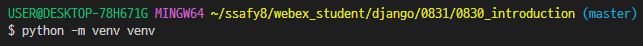
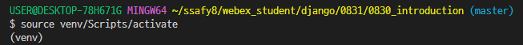
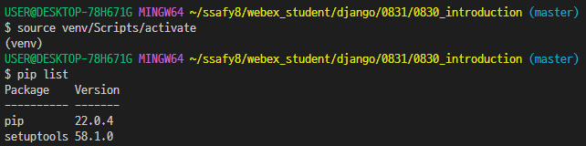
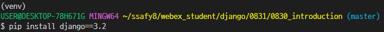
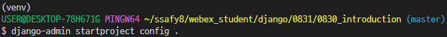

# Django
## 220830 Django
### 목표
* django 프로젝트 생성 및 시작

### django 시작
1. 프로젝트 폴더 생성
2. 가상환경 생성
   * 
3. 가상환경 활성화
   * 
   * source v탭 s탭 a탭
   * 자동 완성으로 하기!
4. pip list로 정상적으로 적용 되었는지 확인
   * 
   * (venv) 가 보이면 가상환경이 활성화
   * 가끔 생기는 오류를 피하기 위해 **<u>꼭 pip list로 다시 확인!!</u>**
5. django 설치
   * 
   * LTS 버전 3.2 설치
6. 패키지 리스트 만들기
   * 
7. 장고 project 생성
   * 
   * 
8. 장고 application 생성