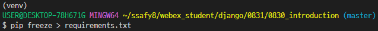

# Django
## 220830 Django
### 목표
* django 프로젝트 생성 및 시작

### django 시작
1. 프로젝트 폴더 생성
2. 가상환경 생성
   * 
3. 가상환경 활성화
   * 
   * source v탭 s탭 a탭
   * 자동 완성으로 하기!
4. pip list로 정상적으로 적용 되었는지 확인
   * 
   * (venv) 가 보이면 가상환경이 활성화
   * 가끔 생기는 오류를 피하기 위해 **<u>꼭 pip list로 다시 확인!!</u>**
5. django 설치
   * 
   * LTS 버전 3.2 설치
6. 패키지 리스트 만들기
   * 
   * 이후 리스트에 맞게 자동으로 설치해야할 때는
   * pip install -r requirements.txt
7. 장고 project 생성
   * 
   * django-admin startporject 프로젝트명 .
   * 마지막에 . 이 있으면, 현재 폴더에 프로젝트 생성
   * . 이 없으면, 프로젝트 폴더를 자동생성해서 그 안에 프로젝트 생성
8. 장고 application 생성
   * python manage.py startapp 앱이름
   * templates 폴더 생성
   * settings.py 에 templates 폴더 등록
     * 'DIRS' : [BASE_DIR / 'templates'],
   * templates 폴더에 base.html 작성
     * bootstrap cdn 추가
     * DTL의 block 태그 추가
   * settings.py에 생성한 application 등록
     * INSTALLED_APPS 리스트에 이름 등록
9. url 분리 진행
   * application 내부 urls.py
     * path 함수 import
     * urlpatterns 작성
     * path
   * 프로젝트 폴더의 urls.py
     * include 함수 import
     * url pattern 작성
10. model 등록
   * models.py에 클래스 정의
   * models.Model 상속받아 작성
   * 필요한 field 사용
   * field의 종류는 공식문서 참고
11. DB에 적용
   * 설계도 생성
   * python manage.py makemigrations
   * 설계도 적용
   * python manage.py migrate
12. CRUD 기능 작성