# Django
## 220831 Django
### 목표
* model의 이해

### namespace
* 앱별로 namespace를 따로 만들어서 사용!

1. 다른 앱에서 동일한 url이름을 사용할 때
* app_name 작성하여 namespace 설정
* a태그 href 작성시 app_name: 으로 작성
* ex) articles:index

2. 여러 앱에 동일한 templates가 존재
* 장고의 기본 경로는 app_name/templates
* 앱별 templates를 구분해보자
* templates에 하위 폴더를 만들어서 물리적인 namespace 구분
* app_name/templates/app_name/

### database
* 체계화, 조직화된 데이터를 수집하는 저장 시스템
* 검색 및 구조화 등의 작업을 보다 쉽게 할 수 있음
* schema, table

#### schema
* 데이터베이서 자료의 구조, 표현 방법, 관계 등을 정의
* 뼈대 structure

#### table
* field 필드와 record 레코드를 사용해 조작된 데이터 요소의 집합
* 관계 relation

#### field 필드
* column 컬럼
* 속성
* 각 필드에 데이터 형식을 지정
  * int, txet 등

#### record 레코드
* row 행
* 튜플
* 테이블의 데이터를 레코드에 저장

#### PK Primary Key
* 기본 키
* 각 레코드의 고유한 값
* 식별자로 사용
* 다른 항목과 절대로 중복되지 않는 unique한 단일 값을 사용
* 테이블간 관계 설정 시 활용

#### query 쿼리
* 데이터를 조회하기 위한 명령어
* 조건에 맞는 데이터를 추출, 조작
* query를 날린다 = db를 조작 한다

### model
***
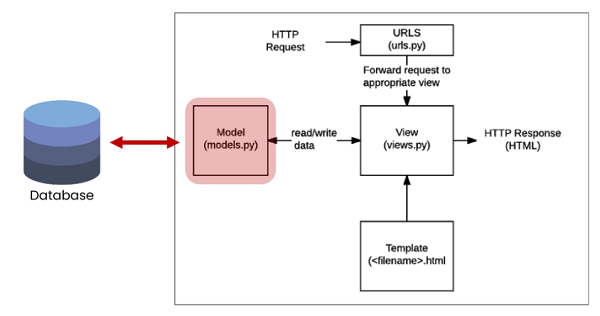
***
* 웹 어플리케이션의 데이터를 구조화하고 조작하기 위한 추상적인 계층
* django는 model을 통해 데이터에 접속, 관리
* 데이터의 필수적인 필드와 동작을 포함
* 저장된 데이터베이스의 구조
* 하나의 모델을 하나의 데이터베이스 테이블에 일대일 mapping
>코드

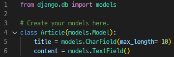

>스키마

|Column|Data Type|
|:--|:--|
|title|VARCHAR(10)|
|content|TEXT|

* 모델 클래스 작성을 통해 데이터베이스 **<u>테이블의 스키마를 정의</u>**하는 작업
* id칼럼(PK)는 Django가 자동으로 생성
* 각 모델은 models.Model 클래스를 상속받음
  * django.models.Model의 서브클래스로 표현
  * **<u>클래스 상속 기반 형태의 프레임워크 개발</u>**
* models의 메서드를 통해 필드를 어떻게 정의할 것인지(스키마) 정의
  * class 변수명은 필드의 이름
  * class 변수값은 필드의 자료형

### Model Field
* django 공식 문서 찾아보기!!
* 데이터베이스의 설계도를 만들기 위한 작업

#### CharField(max_len= None, **options)
* 길이의 제한이 있는 문자열
* max_length
  * CharField의 필수 인자
  * 최대 길이 설정 (최대 255 까지 가능)
  * 데이터베이스와 Django의 유효성 검사 활용
    * ex) 길이가 max_length를 넘는지 아닌지 유효성 검사

#### TextField(**options)
* 글자의 수가 많을 때 사용
* SQLite를 사용할 경우, 최대 길이는 2^31 - 1

### Migrations
* models.py로 모델에 대한 설계도(blueprint)를 만들고, 그에 맞게 동기화하여 테이블을 생성하는 과정
* 작성한 모델을 실제 데이터베이스에 반영
* 명령어
  * **makemigrations** : 설계도 생성
  * **migrate** : 동기화
  * showmigrations
  * sqlmigrate

#### makemigrations
* 작성한 모델에 맞는 migration을 생성
* 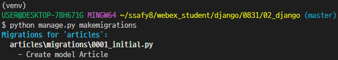
* 테이블을 만들기위한 설계도 생성
* migrations/0001_initial.py 가 생성
  * 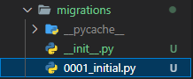
* 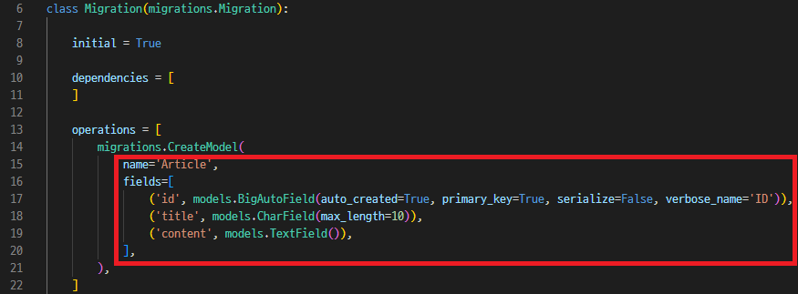
  * fileds 정의
  * id(PK)는 자동으로 생성

#### migrate
* 모델의 변경사항과 데이터베이스를 동기화
* 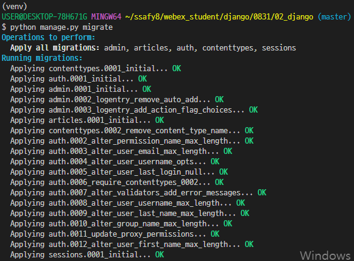
* 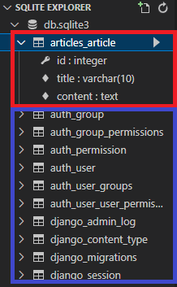
  * appname_modelname 으로 생성
  * 아래는 django 내장앱의 설계도, 똑같이 모델과 동기화

#### showmigrations
* migrations 파일들이 migrate 되었는지 여부 확인
* 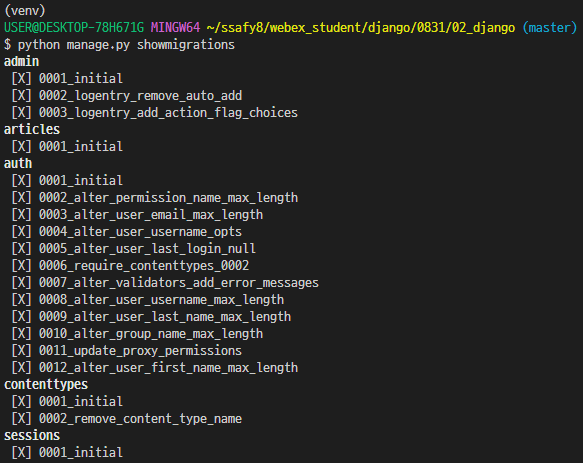
* \[X] 표시가 있으면 migrate 완료

#### sqlmigrate
* 해당 migrations 파일의 SQL문을 미리 보기
* 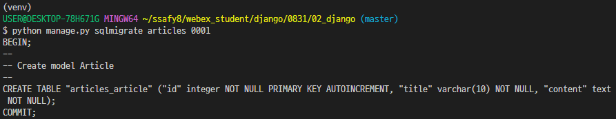

### model 수정
1. models.py 수정하여 model 추가 및 변경
   * 추가 모델 필드를 작성
   * 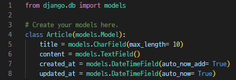
2. 수정 완료 후 다시 makemigration 으로 migrations 파일 생성
   * 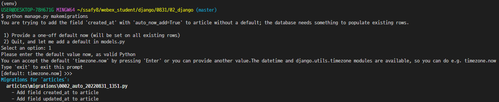
   # 설명 추가
   * 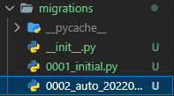
   # 설명 추가
3. migrate으로 데이터베이스와 모델 동기화
   * 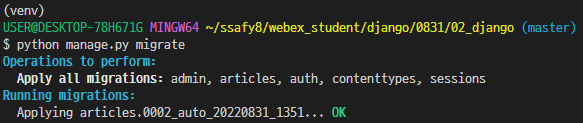
   * 변경된 모델 DB에 반영
   * 
   # 설명 추가
   * 수정 완료 후 migrate 하는 것 까먹지 말기!!

#### DateTimeField()
* python의 datetime.datetime 인스턴스로 표시되는 날짜 및 시간을 값으로 사용하는 필드
* 선택인자
* auto_now_add
  * 최초 생성 일자
  * Django ORM이 최초로 insert 할 때의 날짜와 시간으로 갱신
* auto_now
  * 최종 수정 일자
  * Django ORM이 save할 때마다의 날짜와 시간으로 갱신

### ORM

### QuerySet API
* 외부 라이브러리 설치
  * ipython : 파이썬 쉘
  * django-extensions : django 확장 프로그램
* 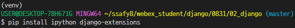
* django-extensions는 설치 후 setting.py에 추가
* 설치 완료 후 패키지 목록 업데이트!
* 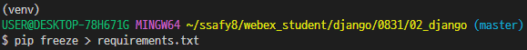

### shell
* 운영체제의 기능과 서비스를 구현하는 인터페이스를 제공하는 프로그램
* 사용자와 운영체제의 소통을 도와주는 프로그램
* 사용자와 운영체제 사이의 인터페이스를 감싸는 층
# 사진 추가

### Django shell
* Django 환경 안에서 진행 가능한 쉘
* 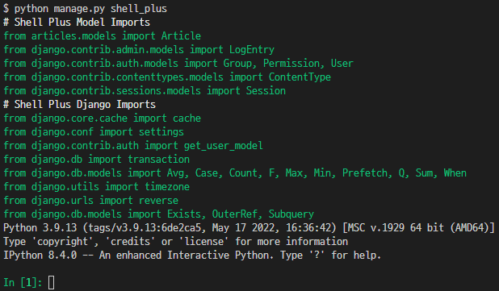
* shell_plus
* Django에서 자주 사용하는 모듈 등을 자동으로 import

## 수정하기
* 사진에서 잘라내기, 제거하고 커맨드만 남기기
* 사진에 테두리로 표시 추가하기
* 사진별 설명 추가하기

* 빈곳 내용 추가하기
  * ORM
  * 
  * 기타 등등