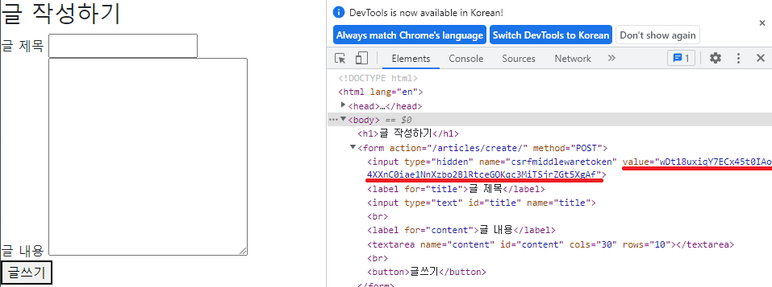

# Django
## 220901 Django
### 목표
* model의 이해

### variable rounting
* query string parameter
* 사용자의 입력이 필요
* variable routing
* 주소 이동할 때 path의 일부분을 변수로 사용
* 사용자의 입력이 필요x
* ex) 사용 예시
* 인스타 주소 뒤에 ID가 붙음, 
* 이 때 주소의 ID부분을 변수로 사용하여
* 그 변수에 해당하는 데이터들을 DB에서 받아와서
* 같은 템플릿의 프로필 페이지에 ID별로 다른 데이터만 출력

```python
urlpatterns = [
    path('hello/<name>/', views.hello)
]
```
* < > 으로 변수 지정

#### 주의 사항
* 변수명과 views.py의 함수 매개변수의 이름이 같아야 함
* variale routing이 설정되면 반드시 매개변수로 받아야 함
  * 선언해두고 매개변수로 안받으면 error 발생
* variable routing이 적용된 주소에는 반드시 값이 들어가 있어야 한다
  * url에 값이 없으면 error 발생


### QuerySet
* DB의 데이터를 담고 있는 유사 리스트
* 음수 index는 사용 불가
* 필터링이나 정렬 가능
* DB가 단일 객체를 반환할 때는, QuerySet이 아니라 인스턴스로 반환!!!
  * ex) .get()

### CRUD
### CREATE

### READ
#### Field lookups
* QuerySet API 공식문서 에서 찾아보기!!
* fieldlookup 사용법, 대표적인 몇 가지 정리
  * gt, lt, contains, startswith, endswith 등등

### UPDATE


#### http response status code
* 1xx 정보 요청
* 2xx 정상 작동
* 3xx 재요청
* 4xx 사용자의 잘못된 요청
* 5xx 서버 오류

#### http method : get vs post
* get
* 특정 리소스를 가져오도록 요청할 때
* 반드시 데이터를 가져올 때만 사용
  * create, update, delete에서 사용 하면 안됨
  * 이 경우는 post 사용
* DB에 변화를 주지 않음
* CRUD에서 READ 역할 담당

* post
* 서버로 데이터를 전송할 때
* 서버에 변경사향을 만듦
* http body에 담아 전송
* get과 달리 URL로 보내지지 않음
* CRUD에서 C, U, D 역할 담당
* post 사용하면 무조건 csrf_token 사용


#### CSRF 공격, 방어방법
* 
* value에 있는 값이 csrf token
* 유효한지 확인후 DB에 접근
* 새로고침하면 새롭게 생성

#### request.method
* get요청일 때는 delete가 안되게 해야함
  * 안그러면 url에서 /delete/ 로 get요청하여 삭제 가능

### Admin site
* django의 강력한 기능
  * 자동으로 admin site 생성

* Admin 계정 생성
* admin.py에 모델 class 등록, 관리