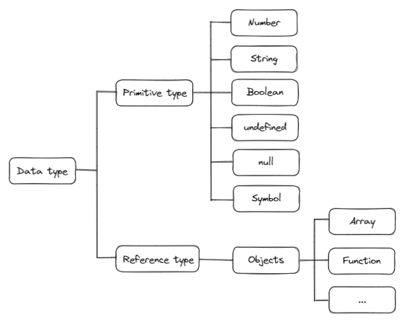

# JavaScript
## 221019 JavaScript 기초
### 목표
* JavaScript 기초 문법 정리


## 코드 스타일 가이드
* Airbnb Style Guide를 기반으로 공부

## identifier 식별자
* 변수명은 문자, $, _ 로 시작
* 대소문자 구분, 소문자로 시작
* 예약어 사용 불가
* 작성 규칙
  * 카멜 케이스 : 변수, 객체, 함수
  * 파스칼 케이스 : 클래스, 생성자
  * 대문자 스네이크 : 상수

## 변수
* 변수 선언 키워드 3개
* let
* const
* var
* Airbnb 스타일 가이드 기준
  * 변수 선언시 const 사용 권장
  * 재할당 필요한 경우 let 사용

|키워드|재선언|재할당|스코프|
|:---:|:---:|:---:|:---:|
|let|x|o|블록 스코프|
|const|x|x|블록 스코프|
|var|o|o|함수 스코프|


### let
* 재할당 o
* 재선언 x
* 블록 스코프 지역 변수 선언

### const
* 재할당 x
* 재선언 x
* 블록 스코프 읽기 전용 상수 선언

### var
* 재할당 o
* 재선언 o
* ES6 이전에 변수 선언시 사용되던 키워드
* 기존에 var로 작성된 코드 때문에 아직 남아있지만 
* **호이스팅**이 발생하므로 **const, let 사용 권장**
* 함수 스코프를 가짐
* 변수 선언시 키워드를 사용하지 않으면, **자동으로 var로 선언**

## block scope 블록 스코프
* 함수의 {} 내부
* 블록 스코프를 가지는 변수는, 블록 밖에서 접근 불가

## hoisting 호이스팅
* 변수 선언 이전에 참조할 수 있는 현상
* var로 선언된 변수는 선언 이전에 참조 가능
* 변수 선언 이전에 접근시 **undefined 반환**
```javascript
// 호이스팅으로 인해 참조 가능
consol.log(number) // 출력은 undefined

var number = 10
```

## 데이터 타입
* 
* primitive type 원시 타입
  * Number, String, Boolean, undeifined, null, Symbol
* reference type 참조 타입
  * Objects
    * Array, Function

## Number
* 숫자를 표현하는 자료형
```javascript
const a = 1
const b = 2.5
const c = 1e9
const d = Infinity  // 매우 큰 값을 표현 가능
const e = -Infinity // 매우 작은 값을 표현 가능
const f = NaN       // 숫자가 아닌 것 표현 가능
```
* NaN : Not a Number 숫자가 아님을 나타냄
* Number.isNaN() : Number 타입이고 NaN이면 true, 아니면 false
```javascript
console.log(Number.isNaN(NaN))      // true
console.log(Number.isNaN('NaN'))    // false

console.log(Number.isNaN(null))     // false
console.log(Number.isNaN(true))     // false
```
* NaN도 Number타입
* NaN을 반환하는 경우
```javascript
// NaN 반환
console.log(Number(undefined))  // 숫자로 읽을 수 없는 경우
console.log(Math.sqrt(-1))      // 허수
console.log(5 + NaN)            // 피연산자가 NaN
console.log(0 * Infinity)       // 정의 불가능한 계산식
console.log('string' - 5)       // 문자열을 포함하면서 덧셈이 아닌 연산

// string5 반환
console.log('string' + 5)       // 문자열 덧셈 연산은 가능, 5 자동 형변환
```

## String
* 문자열을 표현하는 자료형
* 작은 따옴표 혹은 큰 따옴표로 표현
* 문자열에는 덧셈 연산 만 사용 가능
* 따옴표 안에서는 줄 바꿈 허용x , 대신 \n 사용
* **Template Literal** 사용하면
  * 줄 바꿈 o, 표현식, 변수 사용 가능
  * 반드시 **backtick `` 사용!!**
```javascript
console.log('A' + ' + ' + 'B')  // A + B

const result = 0
// backtic ` ` 사용!!
console.log(`A + B = ${result}`) // A + B = 0

// quote ' ' 사용시 문자열로 인식
console.log('A + B = ${result}') // A + B = ${result}

// template literal 사용시 여러 줄 허용
console.log(`a
b
c
`)
// 출력
// a
// b
// c
```

## empty value
* 값이 존재하지 않음을 표현하는 값 2개
  * null
  * undefined
* 역할은 동일
* javascript 오설계로 두가지 존재
```javascript
console.log(typeof null)        // object
console.log(typeof undefined)   // undefined
```
* null은 primitive type 이지만
* javascript 오설계로 인해
* reference type인 object로 출력됨
* 기존에 존재하는 프로그램들 때문에 유지

### null
* null값을 표현
* 변수의 **값이 없음을 의도적으로 표현**할 때 사용

### undefined
* 값이 정의되어 있지 않음을 표현
* 변수 선언 이후 **값을 할당하지 않으면 자동으로 undefined 할당**

## boolean
* true, false 표현
* 조건문, 반복문에서 자동 형변환 규칙에 맞춰 boolean으로 변환 가능

|data type|false|true|
|:---:|:---:|:---:|
|undefined|항상 false|x|
|null|항상 false|x|
|Number|0, -0, NaN|제외 모든 경우|
|String|빈 문자열|제외 모든 경우|
|Objects|x|항상 true|

## 연산자
### 할당 연산자
* +=, -= 사용 가능
* ++, -- 사용 가능

### 비교 연산자
* \>, <, >=, <= 
* 문자열은 유니코드 값으로 비교

### 일치 연산자
* ===
* 두 피연산자의 **타입과 값이 모두 같을 때 true 반환**
* // 객체?? 두 객체가 **같은 객체일 때 true 반환**
* 엄격한 비교를 하여 암묵적 형변환 x
* 같음을 판단할 때 사용 권장
* !== : 부정

### 동등 연산자
* ==
* 두 피연산자가 같은 값일 때 true 반환
* 두 객체가 동일한 객체를 참조하면 true 반환
* 암묵적 형변환을 통해 데이터 타입을 같게만든 후 값을 비교
* != : 부정
```javascript
// 
```

### 논리 연산자
* &&
* ||
* !
* 단축 평가 지원
```javascript
console.log(0 && 2)   // 0  : 앞이 false이므로 0에서 단축평가
console.log(1 || 2)   // 1  : 앞이 true이므로 1에서 단축평가
```