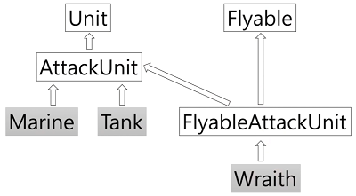

# Python
## 220717 220720 class 복습
### 목표
* 공부한 class개념 연습하기


### 예제로 연습
>작성 코드
```python
from random import *
# 일반 유닛 클래스
class Unit:
    def __init__(self, name, hp, ground_speed):           
        self.name = name
        self.hp = hp
        self.ground_speed = ground_speed
        print(f'{name} 유닛이 생성되었습니다.')

    def move(self, location):  
        print(f'{self.name} : {location} 방향으로 이동합니다. [속도 {self.ground_speed}]')

    def damaged(self, damage):
        print(f'{self.name} : {damage} 데미지를 입었습니다.')
        self.hp -= damage
        print(f'{self.name} : 현재 체력은 {self.hp} 입니다.')
        if self.hp <= 0:
            print(f'{self.name} : 파괴되었습니다.')

# 공격 유닛 클래스
class AttackUnit(Unit):
    def __init__(self, name, hp, ground_speed, damage):
        super().__init__(name, hp, ground_speed)           
        self.damage = damage

    def attack(self, location):
        print(f'{self.name} : {location} 방향으로 적군을 공격 합니다. [공격력 {self.damage}]')

# 마린 유닛 클래스
class Marine(AttackUnit):
    def __init__(self):
        super().__init__('마린', 40, 1, 5)

    def stimpack(self):
        if self.hp > 10:
            self.hp -= 10
            print(f'{self.name} : 스팀팩을 사용합니다. (HP 10 감소)')
        else:
            print(f'{self.name} : 체력이 부족하여 스팀팩을 사용하지 않습니다.')

# 탱크 유닛 클래스
class Tank(AttackUnit):
    seize_developed = False

    def __init__(self):
        super().__init__('탱크', 150, 1, 35)
        self.seize_mode = False

    def set_seize_mode(self):
        if Tank.seize_developed == False:
            return
        
        if self.seize_mode == False:
            print(f'{self.name} : 시즈모드로 전환합니다.')
            self.damage *= 2
            self.seize_mode = True
        else:
            print(f'{self.name} : 시즈모드를 해제합니다.')
            self.damage /= 2
            self.seize_mode = False

# 공중 클래스
class Flyable:
    def __init__(self, flying_speed):
        self.flying_speed = flying_speed

    def fly(self, name, location):
        print(f'{name} : {location} 방향으로 날아갑니다. [속도 {self.flying_speed}]')

# 공중 공격 유닛 클래스
class FlyableAttackUnit(AttackUnit, Flyable):
    def __init__(self, name, hp, damage, flying_speed):
        AttackUnit.__init__(self, name, hp, 0, damage)      
        Flyable.__init__(self, flying_speed)

    def move(self, location):
        self.fly(self.name, location)

# 레이스 클래스
class Wraith(FlyableAttackUnit):
    clocking_developed = False

    def __init__(self):
        super().__init__('레이스', 80, 20, 5)
        self.clocking = False
    
    def set_clocking(self):
        if Wraith.clocking_developed == False:
            return

        if self.clocking == False:
            print(f'{self.name} : 클로킹을 합니다.')
            self.clocking = True
        else:
            print(f'{self.name} : 클로킹을 해제합니다.')
            self.clocking = False
        
def game_start():
    print('[알림] 새로운 게임을 시작합니다.')

def game_over():
    print('player : gg')
    print('[plyaer] 님이 게임에서 퇴장하셨습니다.')


# main
game_start()

m1 = Marine()
m2 = Marine()
m3 = Marine()
m4 = Marine()
t1 = Tank()
t2 = Tank()
t3 = Tank()
w1 = Wraith()
w2 = Wraith()

attack_units = []
attack_units.append(m1)
attack_units.append(m2)
attack_units.append(m3)
attack_units.append(m4)
attack_units.append(t1)
attack_units.append(t2)
attack_units.append(t3)
attack_units.append(w1)
attack_units.append(w2)

for unit in attack_units:
    unit.move('1시')

Tank.seize_developed = True
Wraith.clocking_developed = True
print('[알림] 탱크 시즈 모드 개발이 완료되었습니다.')
print('[알림] 레이스 클로킹 개발이 완료되었습니다.')

for unit in attack_units:
    if isinstance(unit, Marine):
        unit.stimpack()
    elif isinstance(unit, Tank):
        unit.set_seize_mode()
    elif isinstance(unit, Wraith):
        unit.set_clocking()

for unit in attack_units:
    unit.attack('1시')

for unit in attack_units:
    unit.damaged(randint(5, 21))

game_over()
```

>출력
```python
[알림] 새로운 게임을 시작합니다.
마린 유닛이 생성되었습니다.
마린 유닛이 생성되었습니다.
마린 유닛이 생성되었습니다.
마린 유닛이 생성되었습니다.
탱크 유닛이 생성되었습니다.
탱크 유닛이 생성되었습니다.
탱크 유닛이 생성되었습니다.
레이스 유닛이 생성되었습니다.
레이스 유닛이 생성되었습니다.
마린 : 1시 방향으로 이동합니다. [속도 1]    
마린 : 1시 방향으로 이동합니다. [속도 1]    
마린 : 1시 방향으로 이동합니다. [속도 1]    
마린 : 1시 방향으로 이동합니다. [속도 1]    
탱크 : 1시 방향으로 이동합니다. [속도 1]    
탱크 : 1시 방향으로 이동합니다. [속도 1]    
탱크 : 1시 방향으로 이동합니다. [속도 1]    
레이스 : 1시 방향으로 날아갑니다. [속도 5]  
레이스 : 1시 방향으로 날아갑니다. [속도 5]  
[알림] 탱크 시즈 모드 개발이 완료되었습니다.
[알림] 레이스 클로킹 개발이 완료되었습니다. 
마린 : 스팀팩을 사용합니다. (HP 10 감소)    
마린 : 스팀팩을 사용합니다. (HP 10 감소)    
마린 : 스팀팩을 사용합니다. (HP 10 감소)    
마린 : 스팀팩을 사용합니다. (HP 10 감소)    
탱크 : 시즈모드로 전환합니다.
탱크 : 시즈모드로 전환합니다.
탱크 : 시즈모드로 전환합니다.
레이스 : 클로킹을 합니다.
레이스 : 클로킹을 합니다.
마린 : 1시 방향으로 적군을 공격 합니다. [공격력 5]
마린 : 1시 방향으로 적군을 공격 합니다. [공격력 5]
마린 : 1시 방향으로 적군을 공격 합니다. [공격력 5]
마린 : 1시 방향으로 적군을 공격 합니다. [공격력 5]
탱크 : 1시 방향으로 적군을 공격 합니다. [공격력 70]
탱크 : 1시 방향으로 적군을 공격 합니다. [공격력 70]
탱크 : 1시 방향으로 적군을 공격 합니다. [공격력 70]
레이스 : 1시 방향으로 적군을 공격 합니다. [공격력 20]
레이스 : 1시 방향으로 적군을 공격 합니다. [공격력 20]
마린 : 10 데미지를 입었습니다.
마린 : 현재 체력은 20 입니다.
마린 : 11 데미지를 입었습니다.
마린 : 현재 체력은 19 입니다.
마린 : 10 데미지를 입었습니다.
마린 : 현재 체력은 20 입니다.
마린 : 11 데미지를 입었습니다.
마린 : 현재 체력은 19 입니다.
탱크 : 19 데미지를 입었습니다.
탱크 : 현재 체력은 131 입니다.
탱크 : 10 데미지를 입었습니다.
탱크 : 현재 체력은 140 입니다.
탱크 : 18 데미지를 입었습니다.
탱크 : 현재 체력은 132 입니다.
레이스 : 7 데미지를 입었습니다.
레이스 : 현재 체력은 73 입니다.
레이스 : 11 데미지를 입었습니다.
레이스 : 현재 체력은 69 입니다.
player : gg
[plyaer] 님이 게임에서 퇴장하셨습니다.
```


#### 상속 구조




### 참고
* [python class 예제](https://www.youtube.com/watch?v=kWiCuklohdY)