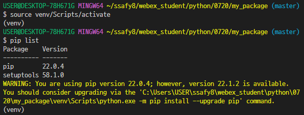

# Python
## 220720 220721 제어문 및 함수
### 목표
* 기초적인 python문법 정리
* python의 조건문, 반복문, 함수의 개념 정리
* module, package를 만들어서 사용해보기
* 가상환경 생성해보기


### control statement 제어문
* 조건문과 반복문으로 구성
* []

### 조건문
#### if
* 특정 조건을 만족할 때 실행
  ```python
  if 조건 == True:
      # code
  elif 조건 == True:
      # code
  else:
      # code
  ```
* if, elif 조건들을 동시에 검사x
* 위에서 부터 순차적으로 검사
* 코드르 짜기전 <u>**순서도 그려서 생각**</u>

* conditional expression
* ternary operator 삼항 연산자라고도 함
>false인 경우에 asign할 때, = 쓰지 않기! (문법 실수)

* true인 경우 값 **if** <u>조건</u> **else** false인 경우 값
```python
# 절대값을 출력
num = -5
value_abs = num if num >= 0 else -num
print(value_abs)
```
```python
# 홀수 짝수 구분
num = 5
print("홀수") if num % 2 == 1 else print("짝수")
```


### 반복문
* while문, for문
* break, continue, for-else
* 특정 조건을 만족할 때까지 같은 동작을 계속 반복


#### while
* 조건식이 참인 경우 반복실행
* 종료 조건 없다면 무한 루프
```python
while 조건: 
      # code
```


#### for
* string, tuple, list, range, enumerate, dictionary 같은 iterable한 객체의 요소를 반복
* dictionary의 경우 .keys(), .values(), .items()를 사용
```python
for 변수명 in iterable: 
      # code
```
```python
# .items() 사용
member = {'a':1, 'b':2, 'c':3}
for a, b in member.items(): 
      print(a, b)
      
# in 뒤에 .items()등을 사용하지 않고 그냥 dict를 사용하면 key로 나오는게 default
for a in member:
      print(a)      # a b c
```

#### enumerate
* 인덱스와 객체를 담은 enumerate 객체 반환
```python
members = ['a', 'b', 'c', 'd']

enumerate(members)
print(list(enumerate(members)))
print(list(enumerate(members, start = 1)))
for idx, member in enumerate(members):
    print(idx, member)
```

#### list comprehension
* 정말 자주 쓴다 중요!!!
* 표현식과 제어문을 통해 특정한 값을 가지는 리스트를 간결하게 생성
```python
# [code for 변수 in iterable if 조건식]
cubic_list = [number**3 for number in range(1, 4)]
print(cubic_list)
```

#### dictionary comprehension
```python
# [key: value for 변수 in iterable if 조건식]
cubic_dict = {number: number**3 for number in range(1, 4)}
print(cubic_dict)
```

#### comprehension 연습하기!!

#### 반복문 제어
* break
  * 루프 종료
* continue
  * 아래 스킵하고 다음 루프로 넘어가기
* for-else
  * 끝까지 반복문을 실행한 이후에 else문 실행
  * break로 중간에 종료하면 else는 실행x
* pass
  * 영향x

```python
# for-else 예시
for char in 'apple':
    if char == 'b':
        print('b가 존재합니다')
        break
else:
    print('b가 존재하지 않습니다')      # b가 없다

for char in 'banana':
    if char == 'b':
        print('b가 존재합니다')         # b가 있다, 아래 else는 실행하지 않음
        break
else:
    print('b가 존재하지 않습니다')
```


### 함수
* 특정한 기능을 하는 코드의 조각 묶음
* 매번 작성하지않고 필요시에만 호출

* Decomposition 분해
* Abstraction 추상화

* Decomposition
  * 기능을 분해하고
  * 재사용 가능하게 만들기
```python
numbers = [1, 2, 3]

# len함수를 분해 하면...
len(numbers)

count = 0
for i in numbers:
    count += 1
print(count)
```

* Abstraction
  * 재사용성과 가독성, 생산성 높이고 유지보수 용이
  * 내부의 복잡한 내용을 모르더라도 사용할 수 있다
  * print('hello')에서 print의 구조를 몰라도 사용 가능

* 함수의 종류
  * 내장 함수 : python의 기본 함수
  * 외장 함수 : import로 외부 라이브러리에서 가져와 쓰기
  * 사용자 정의 함수 : 직접 만드는 함수

#### 함수의 구조
* define, call 선언, 호출
* input 입력
* docstring 문서화
* scope 범위
* output 결과
```python
# 선언
def func_name(func_parameter):
    # docstring

    # body
    return func_return

# 호출
func_name(func_parameter)
```

* output
  * void function : None을 return, 결과가 없다, 파이썬에서는 개념이 약하다 
  * value returning function : 특정 값을 return 
* return 값을 두개 이상 받고 싶다면 , 쓰기
  * return x + y, x - y, x * y, x / y
  * tuple로 반환된다

* print vs return
  * print는 호출될 때마다 출력
  * 데이터 처리를 위해서는 return

* parameter vs argument
  * parameter : 함수를 선언 정의할 때, 함수 내부에서 사용되는 변수
  * argument : 함수를 호출할 때, 넣어주는 값
```python
def func(func_parameter):       # 선언할 때 parameter
    return func_parameter

func(func_argument)             # 호출할 때 argument
```
* argument
  * 필수 argument : 반드시 전달되어야 하는 argument
  * 선택 argument : 값을 전달하지 않으면 기본 설정값으로 전달

* positional arguments
  * argument의 위치에 따라 함수에 전달됨
  * 기본적으로 positional argument
* keyword arguments
  * 직접 변수의 이름으로 특정 argument를 전달
  * **반드시 positional argument 다음에 위치하도록 사용**
* default argument value
  * 기본값을 지정해서 argument값을 설정하지 않아도 되도록 함
  * def에서 정의된 parameter보다 적은 개수의 argument 호출 가능
```python
def func(para1, para2, para3 = 2):    # para3이 default arg
    return (para1 + para2) * para3

func(arg1 = 1, arg2 = 2)
func(1, arg2 = 2)                     # ok
func(arg1 = 1, 2)                     # error 발생 : positional arg 다음 keyword arg
```

* 가변인자 (*args)
  * 여러 개의 positional argument를 하나의 필수 parameter로 받아서 사용
  * 몇 개의 positional argument를 받을지 모를는 함수를 정의할 떄 사용
  * \* : asterisk 시퀀스 언패킹 연산자 
    * 시퀀스를 풀어 헤치는 연산자
    * 주로 tuple list를 언패킹 하는데 사용
    * parameter에 *를 붙여서 가변인자로 사용
```python
def func(*args):                        
    for arg in args:
        print(arg)
    print(type(args))                   # 가변인자는 tuple 로 처리
    # print(type(*args))                # type error 발생

func(2)
func(1, 2, 3, 4, 5)        
```

* 패킹 vs 언패킹
  * 패킹 : 어러 개의 데이터를 묶어서 변수에 할당
  * 언패킹 : 시퀀스 속의 요소들을 여러 개의 변수에 나누어 할당
    * 언패킹시 변수의 개수와 할당하고자 하는 요소의 개수가 동일해야함
```python
numbers = (1, 2, 3, 4, 5)               # 패팅
a, b, c, d, e = numbers                 # 언패킹
a, *rest, e = numbers                   
print(a, e)                             # 1, 5
print(rest)                             # [2, 3, 4]
```

* 가변 키워드 인자(**kwargs)
  * dictionary로 처리할 때
  * 몇 개의 keyword인자를 받을지 모르는 함수를 정의할 때 사용
  * parameter에 **을 붙여 사용
  * **kwargs는 dictionary로 처리
  * keyword인자는 문자열로 사용하면 안됨!! (변수)
  * *arg 와 **kwargs를 같이 사용할 수 있다
```python
def total_price(*words, **price):
    value = 0
    for a, b in price.items():
        print(a, b)
        value += b
    print(f'{words[0]} {words[1]} {value}원 입니다')

total_price('오늘의', '가격은', breakfast = 3000, lunch = 10000, dinner = 10000)
# 오늘의 가격은 23000원 입니다
```


### python의 범위 scope 

* 함수는 코드 내부에 local scope를 생성, 그 외의 공간인 global scope로 구분
* scope
  * global scope : 코드 어디에서든 참조할 수 있는 공간
  * local scope : 함수가 만든 scope. 함수 내부에서만 참조 가능
* variable
  * global variable : global scope에 정의된 변수
  * local variable : local scope에 정의된 변수

* variable lifecycle
  * built-in scope : python이 실행된 이후부터 영원히
  * global scope : 모듈이 호출된 시점 이후 인터프리터가 끝날 때까지 유지
  * local scope : 함수가 호출될 떄 생성 함수가 종료될 때까지 유지

* name resolution 이름 검색 규칙
  * 파이썬에서 사용되는 이름(식별자)들은 이름공간(namespace)에 저장되어 있음
* LEGB rule : L $\rightarrow$ E $\rightarrow$ G $\rightarrow$ B 순서로 검색
  * Local scope : 지역 범위 (현재 작업중인 범위)
  * Enclosed scope : 지역 범위 한 단계 위 범위
  * Gloabal scope : 최상단에 위치한 범위
  * Built-in scope : 모든 것을 담고 있는 범위 (정의하지 않고 사용할수 있는 모든 것, print() 같은 함수)

#### **함수 내에서는 바깥 scope의 변수에 접근 가능하나 수정은 할 수 없음**
* LEGB 연습
```python
print(sum)                      # Built-in function
print(sum(range(2)))
sum = 5                         # variable
print(sum)                      # Local scope (현재는 global)
# print(sum(range(2)))          # error 발생 : L 에서 sum을 호출해서 B의 sum을 사용 불가
```
```python
a = 0
b = 1
def enclosed():
    a = 10
    c = 3
    def local(c):
        print(a, b, c)          # 10 1 300
    local(300)
    print(a, b, c)              # 10 1 3
enclosed()
print(a, b)                     # 0 1
```

* global
  * 현재 코드블록 전체에 global variable로 선언
  * global 선언한 이름은 같은 코드블록에서 global 앞에 등장할 수 없음
  * parameter, for 루프 대상, class, 함수 등을 global로 선언하면 안된다
  ```python
  a = 10
  def func1():  
      # print(a)  # error : 아직 a가 정의되지 않았다
      global a    # global 선언
      a = 3
  
  print(a)        # 10
  func(1)
  print(a)        # 3
  ```

* nonlocal
  * global을 제외하고 가장 가까운 scope의 변수를 연결
  * global과 달리 이미 존재하는 이름과의 연결만 가능
  * nonlocal 선언한 이름은 같은 코드블록에서 nonlocal 앞에 등장할 수 없음
  * parameter, for 루프 대상, class, 함수 등을 global로 선언하면 안된다
  ```python
  a = 10
  def func2():
      a = 5
      def func3():
          nonlocal a
          a = 2
      func3()             
      print(a)            # 2
  
  func2()
  print(a)                # 10
  ```


#### 함수의 범위 주의
* 기본적으로 함수에서 선언된 변수는 local scope에 생성, 함수 종료 시 사라짐
* 해당 scope에 변수가 없는 경우 LEGB rule에 의해 이름을 검색
  * 변수에 접근은 가능하지만, 해당 변수를 수정할 수는 업음
  * 값을 할당하는 경우 해당 scope의 이름공간에 새롭게 생성되기 때문
  * 단, 함수 내에서 필요한 상위 scope 변수는 argument로 넘겨서 사용할 것
* 상위 scope에 있는 변수를 수정하고 싶다면 global, nonlocal 사용
  * 단, 코드가 복잡해지면서 변수의 변경을 추적하기 어렵고, 예기치 못한 오류가 발생
  * 가급적 사용하지 않는 것을 권장 
  * 함수 값을 바꾸고자 한다면 항상 argument로 넘기고 리턴 값 사용을 추천


### builtin function 목록 보기
* dir() 함수 사용
```python
dir(__builtins__)
```


### 함수 응용
* map(func, iterable)
  * iterable한 데이터구조의 모든 요소에 함수를 적용하고
  * 그 결과를 map object로 반환

* .join()
  * 문자열 합치기
  * 다른 자료형이라면 str()으로 변환
  * '구분자'.join()
  * 문자사이 구분자를 넣어서 반환
  * _.join(['a', 'b', 'c'])  $\rightarrow$ 'a_b_c'

* int $\rightarrow$ str 
```python
numbers = [1, 2, 3]                     # int를 str으로 변환
# list comprehension
new_numbers1 = ''.join([str(i) for i in numbers])
print(new_numbers1)

# map
new_numbers2 = ''.join((map(str, numbers)))
print(new_numbers2)
# 123
```
* str => int
```python
numbers = ['1', '2', '3']               # str을 int로

# list comprehension
print([int(i) for i in numbers])

# map
print(map(int, numbers))                # 객체를 반환
print(list(map(int, numbers)))          # 그래서 list()로 출력!!!!
```
---
>주의할 내용!!!
* [1, 2, 3] 과 ['1', '2', '3'] 은 다르다 자료형 조심!!
* '' 과 ' '은 다르게 취급된다!!
---

* filter(func, iterable)
  * iterable한 데이터구조의 모든 요소에 함수를 적용하고
  * 그 결과가 True인 것들을 filter oject로 반환
```python
# 짝수 반환
numbers = [1, 2, 3, 4, 5, 6]
def even(n):
    return not (n % 2)
new_numbers = list(filter(even, numbers))
print(new_numbers)
```

* zip(*iterables)
  * 복수의 iterable을 모아 tuple을 원소로 하는 zip object 반환
  * 간단하게 세로로 묶인다고 생각
```python
a1 = [1, 2, 3]
a2 = [4, 5, 6]
a3 = [7, 8, 9]
result = zip(a1, a2, a3)
print(result, type(result))     # <zip object at 0x00000213C69C44C0> <class 'zip'>
print(list(result))             # [(1, 4, 7), (2, 5, 8), (3, 6, 9)]
```

* lambda parameter: expression
  * 표현식을 계산한 결과값을 반환하는 함소, 익명함수
  * return문을 가질 수 없음
  * 간편 조건문 외 조건문이나 반복문을 가질 수 없음
  * 대신 간결하게 한줄로 사용 가능
  * def을 사용할 수 없는 곳에서도 사용 가능
```python
def circle_area(r):
    return 3.14 * r ** 2

lambda r: 3.14 * r ** 2
```

* recursive function
  * 자기 자신을 호출하는 함수
  * 무한한 호출을 목표로 하는 것이 아니며 알고리즘 설계 및 구현에서 유용하게 활용
  * 점화식과 같이 재귀 함수로 표현하기 쉬운 예들이 있다
  * 변수의 사용이 줄어들고 코드의 가독성이 높아진다
  * 1개 이상의 base case(종료 상황)가 존재하고, 수렴하도록 작성
```python
# factorial
def factorial(n):
    if n == 0 or n == 1:
        return 1
    else:
        return n * factorial(n - 1)

print(factorial(5))
```

* 재귀 함수 주의 사항
  * 파이썬의 maximum recursion depth 최대 재귀 깊이는 1000번
  * base case에 도달할 때까지 함수를 호출하기 때문에
  * 1000번을 넘기면 recursion error 발생 (stack overflow)

* maximum recursion depth 변경하기
  * sys.setrecursionlimit()
```python
import sys
print(sys.getrecursionlimit())          # 재귀 최대 횟수 확인
sys.setrecursionlimit(2000)             # 재귀 최대 횟수 증가시키기
print(sys.getrecursionlimit())          # 증가했는지 확인
```

* 재귀 함수 vs 반복문
  * 알고리즘에서 재귀 함수가 유리한 경우가 있음
  * 재귀 호출은 변수 사용을 줄일 수 있음
  * 재귀 호출은 입력 값이 커질 수록 연산 속도가 오래 걸림

* fibonacci : 재귀 함수 vs 반복문
```python
# reculsive
def fibo_recur(n):
    if n < 2:
        return n
    else:
        return fibo_recur(n-1) + fibo_recur(n-2)
    
for i in range(0,11):
    print((fibo_recur(i)), end =" ")
print('\n')

# while
def fibo_while(n):
    if n < 2:
        return n
    case = [0 ,1]
    i = 2
    while i <= n:
        case.append(case[i - 2] + case[i - 1])
        i += 1
    return case[n]

for i in range(0,11):
    print((fibo_while(i)), end =" ")
print('\n')

# for
def fibo_for(n):
    if n < 2:
        return n
    c0 = 0
    c1 = 1
    for i in range(n-1):
#         temp = c0
#         c0 = c1
#         c1 += temp
        c0, c1 = c1, c0 + c1    # pythonic!
    return c1
    
for i in range(0,11):
    print((fibo_for(i)), end =" ")
```

* n = 35일 때, 재귀 함수와 반복문의 연산시간을 비교해 보자
```python
import time

t0 = time.time()
fibo_recur(35)
t1 = time.time()

time_recur = t1 - t0
print(time_recur)

t2 = time.time()
fibo_while(35)
t3 = time.time()

time_while = t2 - t3
print(time_while)

t4 = time.time()
fibo_for(35)
t5 = time.time()

time_for = t4 - t5
print(time_for)

# 23.311398029327393
# 0.0
# 0.0
```


### 모듈 / 패키지
* module : 다양한 기능을 하나의 파일로
* package : 다양한 파일을 하나의 폴더로
* library : 다양한 패키지를 하나의 묶음으로
* pip : 이것을 관리하는 관리자
* 가상환경 : 패키지의 활용 공간
* library vs framework

* 모듈
  * 특정 기능을 하는 코드를 .py 단위로 작성한 것

* 패키지
  * 특정 기능과 관련된 여러 모듈의 집합
  * 패키지 안에는 또 다른 서브 패키지를 포함

```python
import module
from module import var
from module import *                        # *은 전부 다

from package import module
from package.module import var
```

* pip : 패키지 관리자
  * pip 명령어 검색해서 패키지를 받아서 사용하고 관리해보자
  
  |pip 명령어|의미|
  |:---|:---|
  |$ pip install "package이름"|"이름"의 패키지 설치|
  |$ pip install "package이름"==1.05|특정 버전의 패키지 설치|
  |$ pip install "package이름">-1.04|최소 버전 확인|
  |$ pip uninstall "package이름"|"이름"의 패키지 삭제|
  |$ pip list|설치된 package 리스트|
  |$ pip show "package이름"|"이름"의 패키지 정보 보기|
  |$ pip freeze > requirements.txt|패키지 목록 requirements.txt 관리|
  |$ pip install -r requirements.txt|requirements.txt 의 패키지 설치|

#### 사용자 모듈 패키지
* __init__.py로 패키지 인식 (3.3이전)
  * 하위 버전 호환을 위해 작성

* 패키지 만들기
  * 
* calculator/tools.py 모듈 작성하기
  * 
* check.py에서 모듈 사용해보기
  * 
* 출력
  ```python
  # dir()으로 'add', 'minus'를 사용할 수 있음을 확인

  # ['__builtins__', '__cached__', '__doc__', '__file__', '__loader__', '__name__', '__package__', '__spec__', 'add', 'minus']
  # 3
  ```


#### 가상환경
* 여러 프로젝트를 진행할 때 각각의 버전이 다를 때가 있다
* 이런 경우 가상환경을 만들어서 독립적으로 관리 가능
  
* 특정 디렉토리에 가상환경을 만들어 고유한 파이썬 패키지 관리/사용

* 가상환경 생성
  * $ python -m venv "폴더이름"
  * 
* 가상환경 활성화
  * $ source "폴더이름"/Scripts/activate
  * 
  * pip list에서 아무것도 설치 되어있지 않음을 확인
* 가상환경 비활성화
  * $ deactivate
  * 

