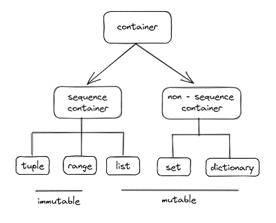

# Python
## 0725 0726 데이터 구조
### 목표
* 메서드를 사용해 데이터 구조를 활용해보자


### 파이썬 공식 문서 표기법
* str.replace(old, new[, count])
  * old, new는 필수 입력
  * [, count]는 선택 옵션 입력


### method
* 메서드는 class 내부에서 정의된 함수
* 데이터구조.메서드() 방식으로 사용
  * 예시 list.append(a)

### dir()로 메서드 찾기
* data별로 사용가능한 메서드 찾기
  * dir(str)      dir(string)
  * dir(list)     dir([])
  * dir(set)
  * dir(tuple)    dir(())
  * dir(dict)     dir({})

#### id()
* 메모리 주소 확인하는 함수
```python
num = '10'
print(id(num))          # 2377594018928
num = '21'
print(id(num))          # 2377636671856
```
* num의 메모리주소가 다른 것으로 보아,
* 하나의 num에서 내용이 바뀐 것이 아니라
* 다른 두 개의 메모리에 자료가 저장 후 num으로 메모리를 참조한 것이다.

* 파이썬은 변수안에 메모리 주소만 들어간다
* C/C++ 에서 pointer 복기하기

### container


### 문자열
* sequence of characters
* immutable하며 모두 str타입

#### 문자열 조회 탐색 메서드
|string.메서드|의미|
|:---|:---|
|.find(a)|a의 첫 번째 위치를 반환, 없으면 **-1 반환**|
|.index(a)|a의 첫 번째 위치의 index를 반환, 없으면 **ValuError**|
|.isaplpha()|알파벳(유니코드 상 letter) 문자 확인|
|.isupper()|대문자 확인|
|.islower()|소문자 확인|
|.istitle()|타이틀 형식 확인|
|.isspace()|공백으로 이루어져 있는지 확인|
|.startswith(a)|a로 시작하는 접두사 검색, **bool 반환**|
|.endswith(a)|a로 끝나는 접미사 검색, **bool 반환**|

```python
print('a'.isalpha())          # True
print('ㄱ'.isalpha())         # True
print('  \n\t '.isspace())    # True

num = ['일', '이', '십일', '십이', '삼십', '삼십일']
ret = []
for i in num:
    if i.startswith('삼'):    # 삼으로 시작하는 것
        ret.append(i)
    elif i.endswith('일'):    # 일로 끝나는 것
        ret.append(i)
print(ret)
```
* 접두사/접미사를 겁색하려고 할 때는 .startswith() .endswith() 사용을 추천
* slicing으로 하려면 인코딩 문제나 whitespace문제를 겪을 수 있다

#### 문자열 검증 메서드
* .isdecimal  .isdigit  .isnumeric
* 숫자를 확인하는 메서드
* .isdecimal이 가장 엄격
  * 완전한 수
* .isdigit
  * 수로 취급할 수 있는 특수문자까지
* .isnumeric이 가장 넓음
  * 수를 표현하는 문자열까지

```python
print('3²'.isdecimal(a))       # False
print('3²'.isdigit(a))         # True
print('3²'.isnumeric(a))       # True

print('⅔'.isdecimal())         # False
print('⅔'.isdigit())           # False
print('⅔'.isnumeric())         # True
```
* 너무 깊게 생각하지 말고, 상황에 맞게 사용하자


#### 문자열 변경 메서드
|string.메서드|의미|
|:---|:---|
|.replace(old, new[, count]|old를 new로 바꿈, [, count]는 몇 개까지|
|.strip()|공백이나, 특정 문자를 제거|
|.split()|공백이나, 특정 문자를 기준으로 분리|
|''.join(iterable)|iterable한 자료형을 ''로 합치기|
|.capitalize()|가장 첫글자 대문자|
|.title()|각 단어의 첫글자는 대문자, 나머지는 소문자, 띄어쓰기 기준|
|.lower()|모두 소문자로|
|.upper()|모두 대문자로|
|.swapcase()|대소문자로 서로 바꾸기|

```python
print('123123123'.replace('1', 'a'))
print('123123123'.replace('1', 'ㄱ', 1))        # [, count] 바꿀 개수

print('     12345\n'.strip())                   # 공백제거
print('     12345'.lstrip())                    # lstrip : left
print('12345     '.rstrip())                    # rstrip : right

# strip(char) 특정 문자(char)를 제거
print('www.naver.com'.strip('wo.cm'))           # naver
print('www.naver.com'.strip('.cm'))             # www.naver.co
print('www.naver.com'.strip('om'))              # www.naver.c
print('www.naver.com'.strip('wo.'))             # naver.com
print('www.naver.com'.strip('.w'))              # naver.com
print('www.naver.com'.strip('wm.'))             # naver.co
print('www.naver.com'.strip('o.c'))             # www.naver.com


print('_'.join(['a', 'b', 'c', 'd', 'e']))      # a_b_c_d_e
```
* .strip(char) : char를 탐색하다가 다른 문자를 만나면 탐색을 종료
* .strip(char) 제거 규칙?


### list
* 순서있는 구조로 저장
* mutable
* index 접근

#### list 메서드
|list.메서드|의미|
|:---|:---|
|.append(a)|마지막에 a 추가|
|.insert(i, a)|인덱스 i에서 a를 삽입, 인덱스 범위보다 크면 가장 끝|
|.remove(a)|왼쪽부터 가장 처음나오는 a를 제거, 없으면 **ValueError**|
|.pop()  .pop(index)|가장 오른쪽에 있는 요소 혹은 index에 있는 요소 제거 및 **반환**|
|.extend(a)|iterable한 a를 마지막에 추가, += 와 같음|
|.clear()|[]로 초기화, 모든 요소 삭제|
|.index(a, start, end)|가장 처음나오는 a의 index 반환, 없으면 **ValueError**|
|.count(a)|a의 갯수를 반환|
|.sort([reverse = ])|정렬, 매개변수 사용가능, **None 반환**, [reverse= ] True: 내림차순 Flase: 오름차순(default) |
|.reverse()|거꾸로 출력, 정렬x|

```python
num = [1]
print(id(num), num)         # 1719968328384 [1]

##### 할당이라서 메모리 주소가 달라진다!
num = [1, 2]
print(id(num), num)         # 1719968295104 [1, 2]

##### 얕은복사라서 메모리 주소가 같다!
num.append(3)
print(id(num), num)         # 1719968295104 [1, 2, 3, 4, 5]
num[len(num):] = [4]
print(id(num), num)         # 1719968295104 [1, 2, 3, 4, 5, 6]
num += [5]
print(id(num), num)         # 1719968295104 [1, 2, 3, 4, 5, 6, 7]

##### .append() vs .extend()
# iterable이라서 얕은복사!!!
num1 = num[:]
num2 = list(num)

num1.append('num1')
num1.append(['num1'])
print(num1)                 # [1, 2, 3, 4, 5, 'num1', ['num1']]
num2.extend('num2')
num2.extend(['num2'])
print(num2, '\n')           # [1, 2, 3, 4, 5, 'n', 'u', 'm', '2', 'num2']

num1.remove(5)      
print(num1)                 # [1, 2, 3, 4, 'num1', ['num1']]
a = num1.pop(-2)
print(a)                    # num1
num1.pop()
print(num1)                 # [1, 2, 3, 4]
print(num)                  # [1, 2, 3, 4, 5] 얕은복사!
num1.clear()
print(num1, '\n')           # []

num = [5, 3, 1, 4, 2, 1, 1]
print(num.index(1))         # 2 index 2에 처음으로 1 등장
print(num.count(1))         # 3 숫자1 3개

num_sorted = sorted(num)
print(num, num_sorted)  
# [5, 3, 1, 4, 2, 1, 1] 원본 그대로,  [1, 1, 1, 2, 3, 4, 5] 새로운 list에 정렬 후 반환
num_sort = num.sort()
print(num, num_sorted)  
# [1, 1, 1, 2, 3, 4, 5] 원본을 정렬, None  None을 반환
 
num = [5, 3, 1, 4, 2, 1, 1]
num_reverse = num.reverse()
print(num, num_reverse)
# [[1, 1, 2, 4, 1, 3, 5] 정렬x 출력만 거꾸로, None  None을 반환
```
* num = 바로 assign 하는 경우 메모리 주소가 다르다
* 하지만 
  * .append()
  * num[len(num):] = []   slicing
  * num += []             시퀀스 연산자
* 를 사용하는 경우에는 메모리 주소가 같다!

* .append()  vs  .extend()
* .extend(iterable)   는 iterable!!
  * iterable을 추가하기 때문에 list 같은 iterable로 입력 [6]
  * string은 iterable하기 때문에 char별로 추가 'n', 'u', 'm', '2'

* list.sort() vs sorted(list)
* list.sort()
  * 원본 list를 정렬
  * None 반환
* sorted(list)
  * 원본은 그대로 두고
  * 새로운 list로 복사 후, 정렬해서 반환

* .count() .remove() 응용하여, 원하는 값을 모두 삭제하려고 할 때
```python
# 중복되는 1을 모두 삭제하려고할 때
num = [1, 2, 3, 1, 2, 4, 1, 2, 5]
target = 1
for i in range(num.count(target)):
    num.remove(target)
print(num)
```

### tuple
* 순서있는 구조로 저장
* immutable
* index 접근
* 값을 변경하는 메소드는 사용 불가능
* 이외에는 대부분 사용 가능
```python
num = (1, 2, 3,)
print(id(num))              # 1763308490816

num *= 2                    # 여기서 * 는 시퀀스형 연산자
print(num)                  # (1, 2, 3, 1, 2, 3)
print(id(num))              # 1763308246240 메모리주소가 다르다

num += True, False          # 여기서 + 는 시퀀스형 연산자
print(num)                  # (1, 2, 3, 1, 2, 3, True, False)
print(id(num))              # 1763308159376 메모리주소가 다르다
```

### set
* 중복을 허용하지 않고, 순서가 없는 구조
* mutable
* index 불가능
* 집합을 표현
* {}으로 생성하면 dictionary이므로 주의

#### set 메서드
|set.메서드|의미|
|:---|:---|
|.copy()|<u>**얕은 복사본**</u>을 반환|
|.add(a)|a를 추가|
|.pop()|랜덤한 요소 제거 후 반환, 빈 set이면 **KeyError**|
|.remove(a)|a를 삭제, 없으면 **KeyError**|
|.discard(a)|a를 삭제, 없어도 에러발생 안함|
|.update(A)|set A에 있는 항목을 추가, 중복x|
|.clear()|()로 초기화, 모든 요소 삭제|
|.isdisjoint(A)|set A와 교집합이 없다면 True 반환, 서로소|
|.issubset(A)|set A의 하위집합 이면 True 반환|
|.issuperset(A)|set A의 상위집합 이면 True 반환|

```python
num1 = {1, 2, 3}
num2 = {3, 4, 5}

print(num1 | num2)               # {1, 2, 3, 4, 5}
print(num1 & num2)               # {3}

num1.update(num2)                # {1, 2, 3, 4, 5}
print(num1)
num1.add('1')
print(num1)                      # {'1', 1, 2, 3, 4, 5}

a = {1, 2, 3, 4, 5, '1', '2', '3'}
b = {1, 2, 3}
c = {'1', '2', '3'}
d = {1, 2, 3}

print(b.isdisjoint(c))
print(b.issubset(a))
print(a.issuperset(c))
print(d.issubset(b))
print(d.issuperset(b))
```
* & , | 으로 연산 가능
* set에서의 pop()은 랜덤으로 추출


### dictionary
* 3.7부터는 순서가 있는 구조
* key는 immutable만 사용

#### dictionary 메서드
|dictionary.메서드|의미|
|:---|:---|
|.copy()|<u>**얕은 복사본**</u>을 반환|
|.keys()|모든 key를 담은 뷰를 반환|
|.values()|모든 value를 담은 뷰를 반환|
|.items()|모든 key value쌍을 담은 뷰를 반환|
|.get(key)|key에 해당하는 value를 반환, key가 없으면 **None 반환**|
|.get(key, val)|key에 해당하는 value를 반환, key가 없으면 **val 반환**|
|.pop(key)|key에 해당하는 value를 반환하고 key항목 제거, 없으면 **KeyError**|
|.pop(key, val)|key에 해당하는 value를 반환하고 key항목 제거, 없으면 **val 반환**|
|.clear()|{}로 초기화, 모든 요소 삭제|
|.update({})|value를 매핑하여 value수정 혹은 새롭게 추가|
||()에는 다른 dictionary나 key/value쌍으로 된 모든 iterable|
|.setdefault(key)|dict에 key가 있으면 그 **value를 반환**, 없으면 dict에 key를 삽입하고 **None 반환**|

```python
d = {'a':0, 'b': 1, 'c':2, 'd':3}
e = 'E'

# print(d['e'])                     # KeyError 발생
print(d.get('e'))                   # None을 반환
print(d.get('e', 4))                # 'e'가 없으면 4를 반환

d.update(e = 4)                     # e 식별자로 사용 , 변수 불가
print(d)                            # {'a': 0, 'b': 1, 'c': 2, 'd': 3, 'e': 4}

d.update({e: 'asdf'})               # dict로 update , key에 변수를 사용하고 싶을 때
d.update({'e': 100})
print(d)                            # {'a': 0, 'b': 1, 'c': 2, 'd': 3, 'e': 100, 'E': 'asdf'}

print(d.setdefault('e'))            # 100
print(d.setdefault('z'))            # None    key 없으면 추가하고 None 반환!
print(d)                            # {'a': 0, 'b': 1, 'c': 2, 'd': 3, 'e': 100, 'E': 'asdf', 'z': None}
```
* .update([other]) 사용시, [other]에는 dictionary 혹은 key/value 쌍으로 된 모든 iterable 가능!
* .setdefault(key)로 key추가하기, 유용하게 사용할 수 있으니 익숙해지기!


#### dictionary 중복 확인하기
* key의 존재를 확인하고, 없으면 생성 있으면 value에 +1
* 조건문도 가능하지만, .get(k, v) 메소드를 활용해보자~
```python
ret = {}
for i in key_lst:
    ret[i] = ret.get(i, 0) + 1

# 값이 없으면 0 반환 후 1 더하기 => 1로 생성
# 값이 있으면 존재하는 value에 1 더하기

ret = {}
for i in data:
    # 존재하면 value 반환 => True
    # 없다면 None 반환    => False
    if cnt.get(i):                  # 존재
        cnt[i] += 1
    else:                           # 존재x
        cnt[i] = 1
```


### shallow copy , deep copy
* python에서의 복사 방법
  * assignment 할당
  * shallow copy 얕은 복사
  * deep copy 깊은 복사

* mutable, immutable : 데이터의 분류에 따라서 복사 방법이 달라진다
* mutable : 얕은복사
* immutable : 깊은복사


#### immutable
```python
a_origin = 1
a_copy = a_origin
a_copy = 100

print(a_origin, a_copy)               # 1 , 100
```

#### mutable
#### assignment
```python
a_origin = [1, 2, 3]
a_copy = a_origin
print(a_origin, a_copy)
#[1, 2, 3] [1, 2, 3]

a_copy[0] = 'a'                         # 복사본을 수정해도
print(a_origin, a_copy)                 # 원본이 같이 바뀜
# ['a', 2, 3] ['a', 2, 3]

print(id(a_origin), id(a_copy))         # 같은 메모리 주소를 사용하기 때문!
# 1847568593664 1847568593664
```
* assign = 을 통한 복사는 해당 객체에 대한 **객체 참조를 복사**
* a_origin과 a_copy는 같은 메모리 주소를 사용
* 이런 경우를 얕은 복사라고 한다

#### 얕은 복사
```python
a_origin = [1, 2, 3]
a_copy = a_origin[:]
print(a_origin, a_copy)
# [1, 2, 3] [1, 2, 3]

a_copy[0] = 'a'                         # slice연산자를 사용하면
print(a_origin, a_copy)                 # 복사본만 바뀐다
# [1, 2, 3] ['a', 2, 3]]

print(id(a_origin), id(a_copy))
# 2141860166144 2141860163392           # 다른 메모리 주소를 사용!
```
* slicing을 통해 다른 주소를 가진 리스트를 복사
* 단, <u>**1차원**</u>에서만 가능
* 얕은복사를 피하는 방법
  * [:]         slicing
  * list()      함수
  * copy.copy() copy모듈
  
```python
a = [1, 2, 3, ['1', '2', '3']]
b = a[:]
print(a, b)
# [1, 2, 3, ['1', '2', '3']]    [1, 2, 3, ['1', '2', '3']]

b[3][0] = 'a'                           # 2차원 이상에서는 문제 발생
print(a, b)
# [1, 2, 3, ['a', '2', '3']] [1, 2, 3, ['a', '2', '3']]
```
* 2차원 이상에서는 문제 발생

#### 깊은 복사
```python
import copy
a = [1, 2, 3, ['1', '2', '3']]
b = copy.deepcopy(a)                    # copy.deepcopy 를 사용!!
print(a, b)
# [1, 2, 3, ['1', '2', '3']] [1, 2, 3, ['1', '2', '3']]

b[3][0] = 'apple'                           # 얕은 복사 문제 해결!!
print(a, b)
# [1, 2, 3, ['1', '2', '3']] [1, 2, 3, ['apple', '2', '3']]
```
* copy모듈을 import해와서
* **copy.deepcopy()**를 사용하여 <u>**깊은 복사**</u>
* 2차원 이상의 list까지 복사


* 알고리즘 문제를 풀다보면 2차원 이상을 주로 다루기 때문에
* 얕은복사 깊은복사 문제를 자주 보게 된다
* 그 때 상황에 맞게 잘 해결하기!!


