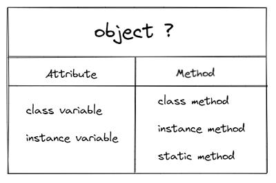
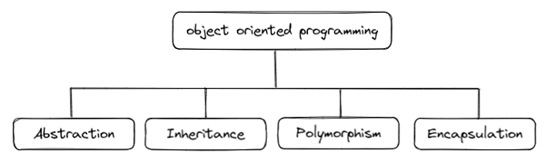

# Python
## 0727 0728 Object Oriented Programming 객체 지향 프로그래밍
### 목표
* oop를이해하고 object class instance의 개념을 설명할 수 있게 이해하기
* 객체 지향 프로그래밍 연습


### OOP 란?
* 객체 지향 프로그래밍(Object Oriented Programming)
* 프로그램을 여러개의 독립된 객체들과 그 객체들 간의 상호작용으로 작성하는 프로그래밍 방법론

* 절차지향
  * 프로그램을 명령어의 목록으로 보는 방법(절차지향)
  * 프로그램이 복잡해지기 시작하면서 유지 보수가 힘들어짐

* 추상화
  * 객체의 용도에 따라 각자의 기준으로 정의, **데이터와 메서드로 분리**
  * 서로다른 객체들의 데이터와 메서드로 상호작용하면서 프로그래밍 

* 장점
  * 프로그램을 클래스 단위로 모듈화하여 대규모 인원이 협업하는 개발에 적합
  * 문제가 있을 때 필요한 부분만 수정하기 쉬워 프로그램의 유지보수가 쉽다

* 단점
  * 다양한 객체들의 상호작용 구조를 설계하기 위해 많은 시간과 노력이 든다
  * 절차지향에 비해 실행 속도가 상대적으로 느리다


### Object 객체
cs에서의 정의
* 객체는 **클래스에서 정의한 것을 토대로 메모리에 할당된 것**
* 프로그램의 데이터 또는 식별자에 의해 참조되는 공간을 의미
* 변수, 자료구조, 함수 또는 메서드를 의미

즉 쉽게 말하면,
* 객체는 **<u>속성</u>과 <u>행동</u>으로 구성된 모든 것**!
* object = attribut + method

* 파이썬의 모든 것엔 속성과 행동이 존재한다
* 그래서 파이썬은 객체 지향 언어



* 특징
  * type 타입 : 어떤 연산자와 조작이 가능한가?
  * attribut 속성 : 어떤 상태를 가지는가? (데이터)
  * method 조작법 : 어떤 행위를 할 수 있는가? (함수)


### classI vs object vs instance
* class 클래스
  * 객체들의 분류, 타입, 설계도

* object 객체
  * 속성과 행동으로 구성된 것

* instance 인스턴스
  * 하나하나의 실체, 실제사례
  * 클래스로 만든 객체를 인스턴스라고 한다

* 클래스를 만든다 == 타입을 만든다

* 클래스 vs 객체
* 타입(클래스)과 실제 사례(객체)
  * list타입 (클래스) 과 [1, 2, 3] (객체) 실제사례
  * string타입 (클래스) 과 'hello world!' (객체) 실제사례

* 객체 vs 인스턴스
* 특정 클래스의 객체를 인스턴스라고 한다
  * [1, 2, 3]은 객체다 (o)
  * [1, 2, 3]은 인스턴스다 (x)
  * [1, 2, 3]은 string의 인스턴스다 (o)

* 클래스 vs 인스턴스
* 객체의 설계도(클래스)를 통해, 객체(인스턴스)를 생성한다

* 객체(object)는 특정 타입(class)의 인스턴스(instance)이다.
  * [1, 2, 3] 은 list의 인스턴스
  * 'hello world!' 는 string의 인스턴스

* [1, 2, 3].sort()
  * 객체.행동()
  * [1, 2, 3] : list의 객체
  * [1, 2, 3] : list의 인스턴스
  * .sort : list의 메서드(함수)

* 파이썬은 모든 것이 객체, 모든 객체는 특정 타입의 인스턴스


### class 문법
```python
# 클래스 정의
class MyClass:
    pass

# 인스턴스 생성
my_instance = MyClass()

# 메서드 호출
my_instance.my_method()

# 속성
my_instance.my_attribute
```

#### 객체 비교
* ==
  * equal 동등
  * 변수가 참조하는 객체가 같은 경우 True
  * 두 객체가 같아 보이지만 실제로 동일한 대상임은 확인x
  * 주소가 달라도 내용물이 같다

* is
  * identical 동일한
  * 두 변수가 동일한 객체를 가리키는 경우 True
  * 메모리 주소가 같다

```python
a = [1, 2, 3]
b = [1, 2, 3]
print(a == b)           # True
print(a is b)           # False

c = [1, 2, 3]
d = c
print(c == d)           # True
print(c is d)           # False
```

#### 속성
* attribute 속성
* 데이터, 정보, 상태
  * 특정 타입/클래스의 객체들이 가지게 될 상태/데이터를 의미
* == 변수
  * 클래스 변수 : 클래스 내부에서 정의된 변수
  * 인스턴스 변수 : self.name

```python
class Unit:
    cnt = 0                                         # 클래스 변수 정의
    # 생성자
    def __init__(self, name, hp, ground_speed):           
        self.name = name                            # 인스턴스 변수 정의
        self.hp = hp
        self.ground_speed = ground_speed
        print(f'{name} 유닛이 생성되었습니다.')

m1 = Unit('마린', 40, 3)                            # 인스턴스 생성
print(Unit.cnt)
Unit.cnt += 1                                       # 클래스 변수 접근 및 할당
print(Unit.cnt)
print(m1.hp)
m1.hp = 60                                          # 클래스 변수 접근 및 할당
print(m1.hp)                                        # 60
```

#### 인스턴스 변수
* self.name
* 각 인스턴스들의 고유한 변수
* 생성자 메서드(\_\_init\_\_)에서 self.name으로 정의
* 인스턴스가 가지고 있는 속성(attribute)
* 인스턴스가 생성된 이후 instance.name 으로 접근 및 할당 

#### 클래스 변수
* 클래스 내부에서 정의된 변수
* classname.name 으로 접근 및 할당

```python
# 위에 이어서
m1 = Unit('마린', 40, 3)                           
m2 = Unit('마린', 40, 3)                           
print(Unit.cnt)                         # 1
print(m1.cnt)                           # 1
print(m2.cnt)                           # 1

# 1. 클래스 변수 변경
Unit.cnt = 2                         
print(Unit.cnt)                         # 2
print(m1.cnt)                           # 2
print(m2.cnt)                           # 2

# 2. 인스턴스 변수 변경
m2.cnt = 4                         
print(Unit.cnt)                         # 2
print(m1.cnt)                           # 2
print(m2.cnt)                           # 4
```
* 헷갈림 주의!!!
* 인스턴스.클래스변수명 으로 클래스변수를 호출 가능!
* 인스턴스 변수가 정의 되어있지 않다면, 클래스 변수를 호출함!

* 클래스변수를 변경할 때는 클래스.클래스변수 로 접근 변경
  * 그러면 클래스로 생성된 모든 객체의 클래스변수가 변경

* 인스턴스하나의 클래스 변수를 바꾸고 싶으면
  * 인스턴스.클래스변수 로 접근


### 메서드
* 클래스 안에 있는 함수
* 특정 클래스의 객체에 공통적으로 적용 가능한 함수

* instance method 인스턴스 메서드
  * self 매개 변수를 통해 인스턴스를 조작
* class method 클래스 메서드
  * cls 매개 변수를 통해 클래스를 조작
* static method 정적 메서드
  * 클래스 변수, 인스턴스 변수를 사용하지 않는 경우에 사용
  * 객체나 클래스 상태를 수정할수 없음
```python
class MyClass:

    def method(self):
        return 'instance method' , self
    
    @classmethod
    def classmethod(cls):
        return 'class mehtod' , cls

    @staticmethod
    def staticmethod():
        return 'static method'

obj = MyClass()                             # 인스턴스 생성
print(obj.method())                         # 인스턴스 메서드 : self로 객체의 주소 반환
print(MyClass.method(obj))                  # 동일한 방법, 위를 권장

print(MyClass.classmethod())                # 클래스 메서드
print(MyClass.staticmethod())               # 스태틱 메서드
MyClass.method()                            # self로 받을 인자가 없어서 오류
```


### instance method 인스턴스 메서드
* 클래스 내부에 정의되는 메서드
* self가 있으면 인스턴스 메서드
* 인스턴스 변수를 사용, 값을 설정하는 메서드
* 호출 시, 첫번째 인자로 self가 전달
* 인스턴스 메서드를 사용하려면, 인스턴스가 호출
  * 인스턴스.메서드

#### self
* 인스턴스 자기자신을 지칭
* 파이썬에서는 인스턴스 메서드 호출 시, 첫번째 인자로 인스턴스 자기자신이 자동으로 전달
  * 매개변수 이름으로 self 정의

#### 매직 메서드
* double underscore __ 가 있는 메서드는 객체의 특수 동작을 지정
* 스페셜 메서드, 매직 메서드라고 한다
* 특정 상황에서 자동으로 호출
* __ 를 던더 라고 한다

* \_\_str\_\_(self)
  * 해당 객체의 출력 형태를 지정
  * print()를 호출할 때, 자동으로 호출
  * 어떤 인스턴스를 출력하면, \_\_str\_\_의 return값이 출력

#### constructor 생성자 메서드
* \_\_init\_\_(self)
* 인스턴스 생성될 때 자동으로 호출 되는 메서드
* 인스턴스 변수들의 초기값 설정

#### destructor 소멸자 메서드
* \_\_del\_\_(self)
* 인스턴스가 소멸되기 직전에 호출 되는 메서드
```python
class Unit:
    # 생성자
    def __init__(self, name, hp, ground_speed):           
        self.name = name
        self.hp = hp
        self.ground_speed = ground_speed
        print(f'{name} 유닛이 생성되었습니다.')

    # 소멸자
    def __del__(self):
        print(f'{self.name} 유닛이 파괴되었습니다.')

m1 = Unit('마린', 40, 3)
del m1
```

#### 데코레이터
* 함수를 어떤 함수로 꾸미기
* @데코레이터 함수 위에 작성
* 순서대로 적용 되기 때문에 작성 순서가 중요
* 함수가 많아져 프로그램이 복잡해졌을 때 수정 용이
```python
# 데코레이터 예시

# 예시 추가하기
```

### class method 클래스 메서드
* 클래스가 사용하는 메서드
* @classmethod 로 정의
* 호출 시, 첫번째 인자로 cls가 전달
```python
class Unit:
    cnt = 0
    def __init__(self, name, hp, ground_speed):           
        self.name = name
        self.hp = hp
        self.ground_speed = ground_speed
        Unit.cnt += 1
        print(f'{name} 유닛이 생성되었습니다.')

    def __del__(self):
        print(f'{self.name} 유닛이 파괴되었습니다.')

    # 클래스 메서드
    @classmethod
    def printNumOfUnit(cls):
        print(f'인구수는 {cls.cnt} 입니다.')

m1 = Unit('마린', 40, 3)
Unit.printNumOfUnit()
del m1
Unit.printNumOfUnit()
```
* 클래스 메서드를 사용하려면, 반드시 클래스로 호출!
  * **클래스**.클래스메서드

### static method 스태틱 메서드
* 인스턴스 변수, 클래스 변수 모두 다루지 않는 메서드
  * cls, self 사용x
  * 객체 상태, 클래스 상태를 수정할 수 없음
* 속성을 다루지 않고, 기능만을 하는 메서드를 정의할 때 사용
* @staticmethod 로 정의
* 클래스의 namespace에 귀속
* 주로 해당 클래스를 한정하는 용도
```python
# static method 예시

# 예시 추가하기
```


### 클래스 vs 인스턴스
* 클래스  - cls
* 인스턴스 - self
* 인스턴스 변수, 클래스 변수 모두 사용하려면
  * 인스턴스 메서드를 사용!

#### namespace 이름공간
* 클래스를 정의하면, 클래스에 해당하는 namespace 생성
* 인스턴스를 만들면, 인스턴스에 해당하는 namespace 생성
* 인스턴스에서 속성(변수)에 접근하면, 인스턴스-클래스 순서로 탐색
  * self.변수가 정의되어 있지 않다면
  * 클래스에서 검색하여 클래스 변수가 출력된다
* 그래서 인스턴스는 클래스 메서드와 스태틱 메서드 모두 접근 가능


### 객체 제치향의 핵심


* **추상화**
* **상속**
* **다형성**
* **캡슐화**

>추상화, 상속, 다형성 예시
```python
# 추상화
# 유닛별로 클래스를 따로 만들어 분리
class Unit:
    def move(self, location):  
        print(f'{self.name} : {location} 방향으로 이동합니다. [속도 {self.ground_speed}]')
class AttackUnit(Unit):    

# 상속
# AttackUnit의 공통 기능은 상속받고
# 유닛별로 다른 기능을 넣기
class Marine(AttackUnit):
class Tank(AttackUnit):

class Flyable:
    def fly(self, name, location):
        print(f'{name} : {location} 방향으로 날아갑니다. [속도 {self.flying_speed}]')

# 다중 상속
class FlyableAttackUnit(AttackUnit, Flyable):

    # 다형성
    # 지상의 move와 공중의 fly를 같은 기능을 하도록 수정
    def move(self, location):
        self.fly(self.name, location)
class Wraith(FlyableAttackUnit):
```

### 추상화
* 실제로는 복잡한 것을 간결하고 명확하게 핵심 위주로 단순화시킴
* 변수
* 함수
* 클래스
* 를 이용하여 추상화
* 복잡한 것을 숨기고, 필요한 것만 드러내기

### 상속
부모 자식간의 관계, 상속받아 재사용
* 두 클래스 사이 부모-자식 관계 정립
* 모든 파이썬 클래스는 object를 상속 받음
* 상속을 통해 상위 클래스의 속성, 메서드 사용하여 <u>**재사용성**</u> 향상
  * 자식 클래스는 부모 클래스의 속성, 행동, 관계 및 제역 조건 모두 상속 받음
  * super()를 통해 부모클래스의 요소를 호출 가능
  * 메서드 오버라이딩을 통해 부모클래스의 메서드를 자식 클래스에서 재정의 가능
  * namespace는 인스턴스 $\rightarrow$ 자식 클래스 $\rightarrow$ 부모 클래스 순으로 탐색 

* isinstance(object, classinfo)
  * object가 classinfo의 instace이거나 subclass 이면 True
* issubclass(class, classinfo)
  * class가 classinfo의 subclass 이면 True
  * classinfo는 클래스 객체의 튜플일 수 있고, classinfo의 모든 항목을 검사
* super()
  * 자식클래스에서 부모클래스를 사용하려고 할 때 사용
  * 다중 상속시에는 첫번째 상속만 호출


#### 다중 상속
* 두 개 이상의 클래스를 상속
* 상속받은 모든 클래스의 요소 사용 가능
* 중복된 상속이나 메소드가 있는 경우 상속 순서로 결정

#### MRO 메서드 
* Method Resolution Order
* 해당 인스턴스의 클래스가 어떤 부모클래스를 가지는지 확인
* 인스턴스 $\rightarrow$ 자식클래스 $\rightarrow$ 부모클래스
```python
class Unit:
    def __init__(self, name, hp, ground_speed):           
        self.name = name
        self.hp = hp
        self.ground_speed = ground_speed
        print(f'{name} 유닛이 생성되었습니다.')

class AttackUnit(Unit):
    def __init__(self, name, hp, ground_speed, damage):
        super().__init__(name, hp, ground_speed)           
        self.damage = damage

class Flyable:
    def __init__(self, flying_speed):
        self.flying_speed = flying_speed

class FlyableAttackUnit(AttackUnit, Flyable):
    def __init__(self, name, hp, damage, flying_speed):
        AttackUnit.__init__(self, name, hp, 0, damage)      
        Flyable.__init__(self, flying_speed)

class Wraith(FlyableAttackUnit):
    def __init__(self):
        super().__init__('레이스', 80, 20, 5)
        self.clocking = False

class Dropship(Unit, Flyable):
    def __init__(self):
        super().__init__('드랍쉽', 120, 0)
        Flyable.__init__(5)

print(Dropship.mro())
print(Wraith.mro()) 

# 출력
# [<class '__main__.Dropship'>, <class '__main__.Unit'>, <class '__main__.Flyable'>, <class 'object'>]
# [<class '__main__.Wraith'>, <class '__main__.FlyableAttackUnit'>, <class '__main__.AttackUnit'>, <class '__main__.Unit'>, <class '__main__.Flyable'>, <class 'object'>]
```
* .mro() 으로 부모 클래스 확인

### 다형성
이름은 같은데 동작은 다른것, 오버라이딩으로 기능 재정의
* 메서드 오버라이딩
* 동일한 메서드가 클래스에 따라 다르게 행동
* 서로 다른 클래스에 속한 객체들이 **<u>동일한 메서드에 다른 기능</u>을 할 수 있다!**

#### method overriding 메소드 오버라이딩
* 상속받은 부모클래스의 메소드를, 자식클래스에서 재정의
* 부모 클래스의 메소드 이름과 기능은 그대로사용하지만, 
* 자식 클래스에서 특정 기능을 추가 수정하고 싶을 때 사용 
```python
class AttackUnit(Unit):
    def __init__(self, name, hp, ground_speed, damage):
        super().__init__(name, hp, ground_speed)           
        self.damage = damage

    def move(self, location):  
        print(f'{self.name} : {location} 방향으로 이동합니다. [속도 {self.ground_speed}]')

class Flyable:
    def __init__(self, flying_speed):
        self.flying_speed = flying_speed

    def fly(self, name, location):
        print(f'{name} : {location} 방향으로 날아갑니다. [속도 {self.flying_speed}]')

class FlyableAttackUnit(AttackUnit, Flyable):
    def __init__(self, name, hp, damage, flying_speed):
        AttackUnit.__init__(self, name, hp, 0, damage)      
        Flyable.__init__(self, flying_speed)

    # 메소드 오버라이딩!
    def move(self, location):
        self.fly(self.name, location)
```
* AttackUnit의 move 메서드와, Flyable의 fly 메서드는 기능은 같지만 명령어가 다름
* 그래서 둘을 move로 통일 시키기 위해서 FlableAttackUnit에서 move 재정의

#### vs 오버로딩
* cs면접 질문 대비!!!
* 파이썬에는 오버로딩이 없다
* 파이썬에서는 *args를 사용하기 때문!!


### 캡슐화
민감한 정보, 중요한 정보를 숨기는 것
* 외부로부터의 직접적인 접근을 차단
* 파이썬에서 암묵적으로 존재하지만, 언어적으로는 존재x
* 협업할 때 프로그램 내부에서 바뀌면 안되는 것들 표현하는 용도 

#### access modifier 접근제어자
* public
* protected
* private
* public $\rightarrow$ protected $\rightarrow$ private 순서로 좁아진다.

#### public member
* 언더바 없이 시작하는 메서드, 속성
* 어디서나 호출 가능
* 하위 클래스 override 허용
* 일반적으로 대다수가 public

#### protected member
* 언더바 1개로 시작하는 메서드, 속성
* 암묵적 규칙에 의해 부모클래스 내부와 자식 클래스에서만 호출 가능
* 하위 클래스 override 허용

#### private member
* 언더바 2개로 시작하는 메서드, 속성
* 본 클래스 내부에서만 사용 가능
* 하위 클래스 상속, 호출 불가능
* 외부 호출 불가능

#### getter, setter
* 변수에 접근할 수 있는 메서드 별도로 생성
* 직접적으로 조회하거나 변경하는것을 막고,
* getter, setter를 통해 우회해서 간접적으로 조회 수정

* getter : 변수의 값을 조회하는 메서드
  * @property
* setter : 변수의 값을 변경하는 메서드
  * @변수.setter

```python
# getter setter 예시
``` 

## 0727 에러와 예외 처리
### debugging 디버깅
* print 함수 활용!
* 특정 함수의 결과, 반복, 조건 등을 나눠서 생각
* 개발환경의 기능 활용 ex) breakpoint
* 코드를 bisection으로 나눠서 생각
* 뇌컴파일, 눈디버깅, 안되면 휴식합시다..
* 코드를 많이 보자!

### error 에러
* Syntax Error

### exception 예외
* 실행 중에 감지되는 에러들을 예외라고 함
* 문법적으로 맞더라도 발생하는 에러
* 모든 내장 exception은 Exception class로 상속 받는다
* 사용자 정의 예외를 만들 수 있다

[내장 예외 공식 문서](https://docs.python.org/ko/3/library/exceptions.html#exception-hierachy)
* ZeroDivisionError
* NameError
* TypeError
* ValueError
* IndexError
* KeyError
* ModuleNotFoundError
* ImportError
* KeyboardInterrupt
* IdentationError


### 예외 처리
* try / except 를 사용하여 예외 처리
* try는 반드시 1개 이상의 except가 필요
* try 문
  * 오류가 발생할 가능성이 있는 코드를 실행
  * 예외가 발생되지 않으면, except 실행 없이 종료
* except 절
  * 예외가 발생하면, except 절이실행
  * 예외 상황을 처리하는 코드 작성
* else 문
  * else 상황
* finally
  * try 또는 except 실행 후, 최종적으로 진행


* except 에러 as 변수
  * as 를 사용하여 원본 에러 메세지 사용 가능

* except (에러1, 에러2)
  * 여러 에러 한번에 처리 가능

* except 에러1:
* except 에러2:
  * 여러 에러 별도로 처리 가능
  * 순차적으로 수행되니, 가장 작은 범위부터 예외 처리 진행

```python
try:
    f = open('lecture.txt')
except FileNotFoundError:
    print('해당 파일이 없습니다.')
else:
    print('파일을 읽는 중 입니다.')
    print(f.read())
    print('파일을 모두 읽었습니다.')
    f.close()
finally:
    print('파일 읽기를 종료합니다.')
```
* 파일을 열고 읽는 코드
* 파일을 열기
  * try
* 없는경우 : '해당 파일이 없습니다' 출력
  * except
* 있는경우 : 파일 내용을 출력
  * else
* 읽기 작업 종료 메세지 출력
  * finally


### 참고
* [python class 정리](/Python_0717.md)
* [python class 예제](https://www.youtube.com/watch?v=kWiCuklohdY)


### 추가하기
* 오버로딩 관련 내용 추가하기