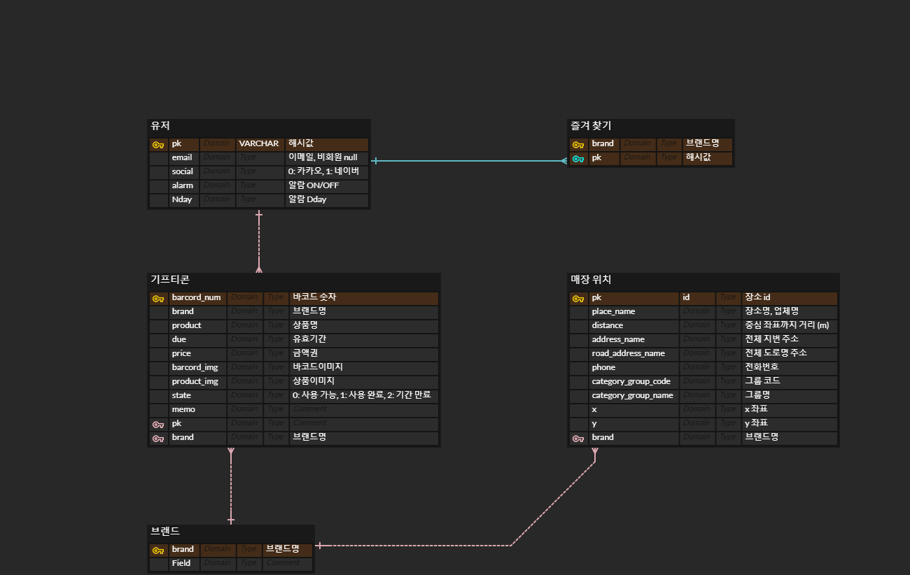
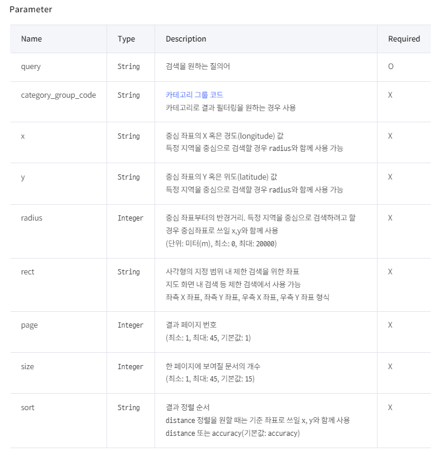
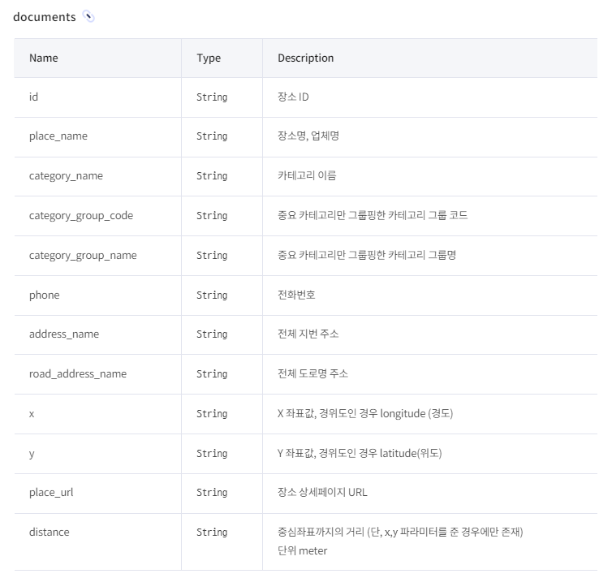

## 230109 정리
## user flow chart 회의


## UI 회의


## erd 작성


## kakao 로컬 API 테스트 해보기
* 서울 강남구 삼성동 20km 반경에서 스타벅스 매장 검색

### Parameter


### documents


### POSTMAN
* https://dapi.kakao.com/v2/local/search/keyword.json?y=37.514322572335935&x=127.06283102249932&radius=20000
* Authorization: KakaoAK ${REST_API_KEY}
* query: 스타벅스
  


* 결과
```javascript
{
    "documents": [
        {
            "address_name": "서울 강남구 삼성동 154-10",
            "category_group_code": "CE7",
            "category_group_name": "카페",
            "category_name": "음식점 > 카페 > 커피전문점 > 스타벅스",
            "distance": "668",
            "id": "20705151",
            "phone": "",
            "place_name": "스타벅스 삼성도심공항점",
            "place_url": "http://place.map.kakao.com/20705151",
            "road_address_name": "서울 강남구 테헤란로87길 33",
            "x": "127.057877757208",
            "y": "37.5097660222399"
        },
        {
            "address_name": "서울 강남구 삼성동 108-6",
            "category_group_code": "CE7",
            "category_group_name": "카페",
            "category_name": "음식점 > 카페 > 커피전문점 > 스타벅스",
            "distance": "82",
            "id": "1759724595",
            "phone": "1522-3232",
            "place_name": "스타벅스 봉은사역점",
            "place_url": "http://place.map.kakao.com/1759724595",
            "road_address_name": "서울 강남구 봉은사로 619",
            "x": "127.063116657513",
            "y": "37.5150288069818"
        },
        {
            "address_name": "서울 강남구 삼성동 91-34",
            "category_group_code": "CE7",
            "category_group_name": "카페",
            "category_name": "음식점 > 카페 > 커피전문점 > 스타벅스",
            "distance": "247",
            "id": "17884741",
            "phone": "",
            "place_name": "스타벅스 코엑스사거리점",
            "place_url": "http://place.map.kakao.com/17884741",
            "road_address_name": "서울 강남구 영동대로 616",
            "x": "127.0602165265151",
            "y": "37.5151132134315"
        },
        {
            "address_name": "서울 강남구 삼성동 159",
            "category_group_code": "CE7",
            "category_group_name": "카페",
            "category_name": "음식점 > 카페 > 커피전문점 > 스타벅스",
            "distance": "355",
            "id": "23707172",
            "phone": "1522-3232",
            "place_name": "스타벅스 코엑스몰점",
            "place_url": "http://place.map.kakao.com/23707172",
            "road_address_name": "서울 강남구 영동대로 513",
            "x": "127.05902063946782",
            "y": "37.513310007386"
        },
        {
            "address_name": "서울 강남구 삼성동 159",
            "category_group_code": "CE7",
            "category_group_name": "카페",
            "category_name": "음식점 > 카페 > 커피전문점 > 스타벅스",
            "distance": "302",
            "id": "138857828",
            "phone": "1522-3232",
            "place_name": "스타벅스 코엑스아셈타워점",
            "place_url": "http://place.map.kakao.com/138857828",
            "road_address_name": "서울 강남구 영동대로 517",
            "x": "127.059782819493",
            "y": "37.5130852740943"
        },
        {
            "address_name": "서울 강남구 삼성동 168-22",
            "category_group_code": "CE7",
            "category_group_name": "카페",
            "category_name": "음식점 > 카페 > 커피전문점 > 스타벅스",
            "distance": "403",
            "id": "1705256411",
            "phone": "1522-3232",
            "place_name": "스타벅스 삼성동점",
            "place_url": "http://place.map.kakao.com/1705256411",
            "road_address_name": "서울 강남구 영동대로96길 12",
            "x": "127.063583565949",
            "y": "37.5107397774703"
        },
        {
            "address_name": "서울 강남구 삼성동 159",
            "category_group_code": "CE7",
            "category_group_name": "카페",
            "category_name": "음식점 > 카페 > 커피전문점 > 스타벅스",
            "distance": "426",
            "id": "705420639",
            "phone": "1522-3232",
            "place_name": "스타벅스 코엑스별마당점",
            "place_url": "http://place.map.kakao.com/705420639",
            "road_address_name": "서울 강남구 영동대로 513",
            "x": "127.059159721989",
            "y": "37.5118232810781"
        },
        {
            "address_name": "서울 강남구 삼성동 159-9",
            "category_group_code": "CE7",
            "category_group_name": "카페",
            "category_name": "음식점 > 카페 > 커피전문점 > 스타벅스",
            "distance": "512",
            "id": "1997478625",
            "phone": "1522-3232",
            "place_name": "스타벅스 스타필드코엑스몰 R점",
            "place_url": "http://place.map.kakao.com/1997478625",
            "road_address_name": "",
            "x": "127.06163059015883",
            "y": "37.50980376800015"
        },
        {
            "address_name": "서울 강남구 대치동 1001-8",
            "category_group_code": "CE7",
            "category_group_name": "카페",
            "category_name": "음식점 > 카페 > 커피전문점 > 스타벅스",
            "distance": "751",
            "id": "19616330",
            "phone": "",
            "place_name": "스타벅스 삼성교점",
            "place_url": "http://place.map.kakao.com/19616330",
            "road_address_name": "서울 강남구 영동대로86길 12",
            "x": "127.065200697954",
            "y": "37.5078160371362"
        },
        {
            "address_name": "서울 강남구 대치동 944-31",
            "category_group_code": "CE7",
            "category_group_name": "카페",
            "category_name": "음식점 > 카페 > 커피전문점 > 스타벅스",
            "distance": "792",
            "id": "2002518777",
            "phone": "1522-3232",
            "place_name": "스타벅스 삼성역섬유센터R점",
            "place_url": "http://place.map.kakao.com/2002518777",
            "road_address_name": "서울 강남구 테헤란로 518",
            "x": "127.06050441304848",
            "y": "37.507425697870396"
        },
        {
            "address_name": "서울 강남구 대치동 996-1",
            "category_group_code": "CE7",
            "category_group_name": "카페",
            "category_name": "음식점 > 카페 > 커피전문점 > 스타벅스",
            "distance": "618",
            "id": "48890693",
            "phone": "1522-3232",
            "place_name": "스타벅스 삼성역점",
            "place_url": "http://place.map.kakao.com/48890693",
            "road_address_name": "서울 강남구 테헤란로 620",
            "x": "127.0655774019",
            "y": "37.5091961677633"
        },
        {
            "address_name": "서울 강남구 삼성동 51",
            "category_group_code": "CE7",
            "category_group_name": "카페",
            "category_name": "음식점 > 카페 > 커피전문점 > 스타벅스",
            "distance": "895",
            "id": "7968405",
            "phone": "",
            "place_name": "스타벅스 삼성현대힐점",
            "place_url": "http://place.map.kakao.com/7968405",
            "road_address_name": "서울 강남구 삼성로 605",
            "x": "127.052754513275",
            "y": "37.5135238071297"
        },
        {
            "address_name": "서울 강남구 삼성동 157-36",
            "category_group_code": "CE7",
            "category_group_name": "카페",
            "category_name": "음식점 > 카페 > 커피전문점 > 스타벅스",
            "distance": "897",
            "id": "7962108",
            "phone": "",
            "place_name": "스타벅스 포스코사거리",
            "place_url": "http://place.map.kakao.com/7962108",
            "road_address_name": "서울 강남구 테헤란로 505",
            "x": "127.05747785596",
            "y": "37.5074524374612"
        },
        {
            "address_name": "서울 강남구 청담동 132-1",
            "category_group_code": "CE7",
            "category_group_name": "카페",
            "category_name": "음식점 > 카페 > 커피전문점 > 스타벅스",
            "distance": "1030",
            "id": "1062647229",
            "phone": "1522-3232",
            "place_name": "스타벅스 청담영동대로점",
            "place_url": "http://place.map.kakao.com/1062647229",
            "road_address_name": "서울 강남구 영동대로 720",
            "x": "127.056457403591",
            "y": "37.5220924385651"
        },
        {
            "address_name": "서울 강남구 삼성동 144-26",
            "category_group_code": "CE7",
            "category_group_name": "카페",
            "category_name": "음식점 > 카페 > 커피전문점 > 스타벅스",
            "distance": "1038",
            "id": "11116096",
            "phone": "",
            "place_name": "스타벅스 삼성점",
            "place_url": "http://place.map.kakao.com/11116096",
            "road_address_name": "서울 강남구 테헤란로 443",
            "x": "127.055713054807",
            "y": "37.5068766398583"
        }
    ],
    "meta": {
        "is_end": false,
        "pageable_count": 45,
        "same_name": {
            "keyword": "스타벅스",
            "region": [],
            "selected_region": ""
        },
        "total_count": 736
    }
}
```

## 더 생각해봐야할 것
* 카카오 로컬 API 요청을 최소화하기 위한 방법
* DB에 매장 위치 정보를 캐싱
* 어떤 방식으로 구현?