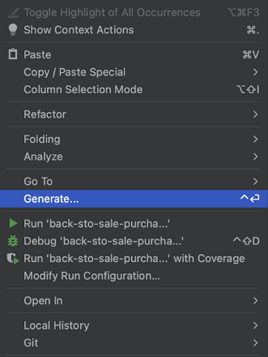
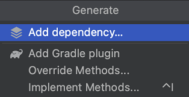

# 개발 환경 세팅
## 빌드 툴
* 프로젝트에 필요한 xml, properties, jar 파일 자동 인식 빌드
* 소스 코드를 컴파일, 테스트, 정적분석 등을 하여 실행가능한 앱으로 빌드
* 프로젝트 정보 관리, 테스트 빌드, 배포 등의 작업 진행
* 외부 라이브러리 자동 다운로드 및 업데이트 관리

### Maven
* xml 기반 빌드 스크립트
* 라이프 사이클
* pom.xml로 dependency 관리
* pom.xml 역할
  * 프로젝트 정보 관리
  * 외부 라이브러리 관리
  * 프로젝트의 빌드 관련 설정

### Gradle
* groovy 스크립트를 활용한 빌드 관리 도구
* 안드로이드 프로젝트의 표준 빌드 시스템
* 멀티 프로젝트의 빌드에 최적화
* Maven에 비해 간결한 구성과 더 빠른 처리속도를 가짐

### Maven vs Gradle
* Maven의 점유율이 더 높음
* Gradle의 성능이 더 좋음
* Gradle이 대규모 프로젝트에서의 성능이 좋음

## jdk
* Java SE 11

## IDE
* IntelliJ

## IntelliJ 에서 dependencies 추가
* 우클릭 -> Generate
* 
* Add dependency
* 
* dependency 검색 후 추가
* load gradle changes

## Kakao Local API 테스트2
* 프로젝트 생성해서 테스트 해보기