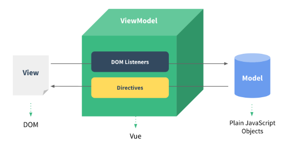

# Vue
## 221031 Vue 기초
### 목표
* Vue 기초 정리


## Front-end framework
* 사용자에게 보여지는 화면 제작
* Web App (SPA)을 만들 때 사용하는 도구
* SPA Single Page Application
* 백엔드 서버가 주는 데이터들을 구조에 맞게 예쁘게 랜더링
* 생산성 향상 및 협업에 용이
* React, Angular, Vue

### Web App
* 웹 브라우저에서 실행되는 어플리케이션
* 개발자 도구에서 디바이스 모드로 설정하면
* 웹 페이지가 디바이스에 설치된 App처럼 보이도록 레이아웃이 변경
* 웹 페이지가 디바이스에 맞는 UI/UX로 표현되는 형태

### SPA Single Page Applicaion
* SPA는 CSR Client Side Rendering 방식으로 요청을 처리
* 서버에서 최초 1장의 빈 HTML만 전달받아 클라이언트에서 모든 요청에 대응
* 각 요청에 대한 대응을 JavaScript를 사용하여 필요한 부분만 랜더링
1. 필요한 페이지를 서버에 AJAX로 요청
2. 화면을 그리기위해 필요한 데이터를 JSON으로 전달
3. JSON데이터를 JavaScript로 처리, DOM 트리에 반영, 랜더링  

### vs SSR
* django로만 제작했을 때는 SSR Server Side Rendering 방식으로 요청 처리 
* 서버에서 랜더링하여 사용자의 요청에 대응되는 페이지 별로 template를 반환
* 전달 받은 새 문서를 보여주기 위해 브라우저는 매 번 새로고침을 해야함

### CSR 사용 장점
1. 모든 HTML 페이지를 서버로부터 표시 안해도 됨
   * 클라이언트 - 서버간 트래픽 감소하여 응답속도가 빠름
2. 매 요청에 새 문서를 받아 새로고침하지 않고, 필요한 부분만 랜더링
   * 각 요청이 끊김없이 진행되어 UX 향상 
3. FE와 BE의 작업 영역을 분리
   * 분업이 되어 협업이 용이

### CSR 사용 단점
1. 첫 구동에 필요한 데이터가 많을수록, 최초 작동 시작까지 오랜 시간이 소요 
   * ex) 모바일 어플 (Web App) 처음 실행시, 잠깐 로딩 시간이 필요
   * Netflix 켰을 때, 처음에 로고 뜨는게 로딩 시간!
2. 검색 엔진 최적화 가 어려움
   * SEO Search Engine Optimization
   * CSR 방식은 최초에 서버로부터 빈 HTML문서를 받고,
   * 나중에 클라이언트에서 AJAX 요청으로 JSON 데이터를 받아와서 내용을 작성
   * 검색엔진은 HTML의 내용을 기반으로 하기 때문에, 
   * 빈 HTML인 CSR방식은 서비스가 노출되기 어려움

### SEO Search Engine Optimization
* 검색 엔진은 주로 HTML에 작성된 내용을 기반으로 작동
* JavaScript가 실행된 이후의 결과를 확인하는 과정 없음
* SPA 서비스도 검색 대상으로 넓히기 위해 JS를 지원하도록 발전 중
* 그래도 여전히 CSR방식이 페이지 검색에서는 불리함

### CSR vs SSR 
* 구현하려는 서비스의 상황에 맞게 랜더링 방식을 사용!

## Vue
### MVVM pattern

* 마크업 언어로 구현하는 GUI(view)의 개발을 back-end(model)로부터 분리
* view가 어느 특정한 모델 플랫폼에 종속되지 않게 함
* View : DOM 사용자가 보는 부분
* Model : JSON 데이터, 객체
* View Model : 
  * Vue
  * View와 binding되어 action을 주고 받음
  * Model이 변경되면, 
  * View Model 변경 -> 바인딩된 View도 변경
  * View에서 사용자가 데이터를 변경하면,
  * View Model 변경 -> 바인딩된 다른 View도 변경
* MVC 패턴에서 Controll 부분에 View Model 으로 대체한 패턴
* M, V 각각이 독립적, 의존성 감소
* View의 데이터를 변경하면, View Model의 데이터 변경 -> 바인딩된 다른 View도 변경

### Vue instance
* 생성자 함수로 Vue instance 생성

### el element

### v-for
### key
* **<u>v-for 사용시 반드시 key 속성을 각 요소에 작성</u>**
* v-for directive 작성 시 사용
* 반복되는 각각의 요소에 식별자 부여
* key가 중복되면 안됨
* 각 요소가 고유한 값을 가지고 있다면 생략 가능
* 배열은 보통 문자열과 index 섞어서 사용
```html
<div v-for="(item, index) in Arr" :key="`arry-${index}`"></div>
```
* 객체는 자체 key 사용
```html
<div v-for="(value, key) in myObj" :key="key"></div>
```