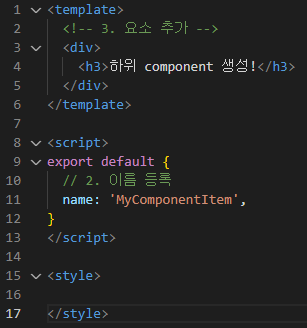
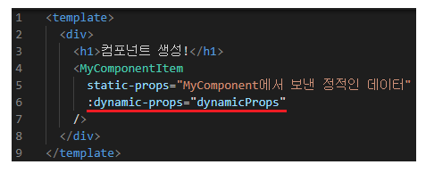

# Vue
## 221102 Vue 기초
### 목표
* Vue-cli 기초 정리
* 프로젝트 생성 및 서버 구축
* SFC 이해


## Node.js
* 자바스크립트를 브라우저가 아닌 환경에서도 구동하기 위한 런타임 환경
* NPM Node Package Manage : 자바스크립트 패키지 관리자
* Node.js에서는 npm 으로 사용

## Vue CLI
* Vue 개발을 위한 표준 도구
* 프로젝트 구성을 도와주는 역할
```
$ npm install -g @vue/cli
```
* 프로젝트 생성은 VScode terminal 에서 실행
  * interactive shell 에서 실행
```
$ vue create vue-cli
```
* 사용하려는 버전(Vue2) 선택


* <u>vue-cli 폴더로 이동해서</u> run serve
```
$ cd vue-cli
$ npm run serve
```


* 생성된 프로젝트


* 여러 초기 설정들이 자동으로 동작
* 기본적으로 .gitignore, git init 되어 있음

### node_modules 
* node.js 환경의 여러 의존성 모듈
* python 의 venv와 비슷한 역할
* .gitignore에 넣어주기 (프로젝트 생성시 자동 추가)

### node_modules/babel
* JavaScript compiler
* 자바스크립트 ES6+ 코드를 구버전으로 변환 해주는 도구
* 브라우저 버전 별로 동작하지 않아서 버전 별로 다른 코드를 작성해야 하는 문제를 해결
* 원시 코드(최신 버전)를 목적 코드(구 버전)으로 옮기는 번역기 역할

### node_modules/webpack
* static module bundler
* 모듈 간의 의존성 문제를 해결하는 도구
* 프로젝트에 필요한 모든 모듈을 매핑하고 내부적으로 종속성 그래프 빌드
* 모듈간의 의존성 문제
  * 모듈의 수가 많아지고 서로간의 의존성이 깊어지면서
  * 특정한 곳에 발생한 문제가 어떤 모듈간의 문제인지 파악하기 어려움
* Bundler
  * 모듈 의존성 문제를 해결해주는 작업이 bundling, 도구가 bundler
  * Webpack은 다양한 bundler 중 하나
  * 모듈들을 하나로 묶어줌
  * bundling된 결과물은 개별 모듈의 실행 순서에 영향 받지 않고 동작

### package.json
* 프로젝트의 종속성 목록
* 지원되는 브라우저에 대한 구성 옵션

### package-lock.json
* node_modules에 설치되는 모듈과 관련된 모든 의존성을 설정 및 관리
* 협업, 배포 환경에서 동일한 종속성을 보장하여 의존성 패키지 충돌 방지
* python의 requirements.txt 역할

### public/index.html
* Vue 앱의 뼈대가 되는 html 파일
* SPA 방식에서 최초의 html 파일

### src/assets
* 정적 파일을 저장하는 디렉토리

### src/components
* 하위 컴포넌트들

### src/App.vue
* 최상위 컴포넌트들
* public/index.html과 연결

## Component
* UI를 독립적이고 재사용 가능한 조각들로 나눈 것
* 재사용성을 위해 개발된 SW 구성 요소
* 하나의 app을 구성할 때 중첩된 컴포넌트들이 tree로 구성
  * Vue에서는 src/App.vue를 root로 component들이 연결된 하는 tree 구조

### comonent based architecture
* 한 화면을 여러개의 컴포넌트로 이루어지는 구조로 개발
* 유지보수 용이
* 재사용성
* 확장성
* 캡슐화
* 독립

## SFC Single File Component
* Vue 에서의 하나의 component 
* = Vue instance 
* = new Vue()로 만든 인스턴스 
* = 하나의 .vue 파일 
* = Single File Component
* Vue instance를 **기능 단위로 작성**

## Vue component 구조
* 템플릿 (HTML)
  * HTML의 body 부분 작성
  * 눈으로 보여지는 요소
* 스크립트 (JavaScript)
  * JavaScript 코드 작성
  * vue 인스턴스 작성
* 스타일 (CSS)
  * CSS 작성
* App.vue를 root로 하여 컴포넌트들이 아래로 연결되는 tree구조로 하나의 페이지가 구성됨
* App.vue를 index.html과 연결
* index.html 파일 한개만 렌더링 => SPA

### component 작성
1. src/components/ 에 파일 생성
   * 
   * PascalCase로 작성
2. script 에 이름 등록
   * 
   * name 파일명과 동일하게 작성 권장, 달라도 상관 없음
3. template 에 요소 추가
   * 
   * templates 에는 반드시 하나의 요소만 추가
   * 해당 요소 안에 추가 요소를 작성
   * 비어도 안됨

### component 등록
* App.vue 에서
1. 불러오기
   * 절대경로 src/ 의 shortcut @
   * 불러오는 확장자가 .vue 이면 생략 가능
2. 등록하기
3. 보여주기

* 결과 화면


### 하위 component 생성 및 등록
1. src/components/ 에 파일 생성
   * 
2. script 에 이름 등록
3. template 에 요소 추가
   * 

* MyComponent.vue 에서
1. 불러오기
2. 등록하기
3. 보여주기


#### 결과 화면


## SFC 이름 규칙
* Vue.js 스타일 가이드 참고
* 컴포넌트 명은 PascalCase로 작성
  * ex) MyComponent.vue
* base component 이면, 
  * 이름에 Base, App, V 붙이기
  * ex) BaseButton.vue, AppButton.vue, VButton.vue
* single instance component 이면, 
  * 이름에 The붙이기
  * 다른 곳에 하위로 쓰이지 않고, 단독으로 쓰이는 경우
  * ex) TheHeading.vue
* tightly coupled component 이면,
  * parent component의 이름을 접두사로 사용
  * ex) MyComponentItem.vue

## data
* 동적 웹페이지를 만들기 위해서 각 component에 존재하는 data 공유 필요
* Vue에서는 부모-자식 관계끼리만 데이터를 주고 받을 수 있게 함
  * 부모-자식 **<u>한 단계</u>**까지만
  * 데이터의 흐름 파악에 용이
  * 유지 보수가 용이
* **pass props** : 부모 => 자식
* **emit event** : 자식 => 부모

## pass props
* 부모 => 자식 으로 data 전달
* 아래쪽 단방향 바인딩 형성
* 부모 컴포넌트가 업데이트 => 자식 컴포넌트도 자동으로 업데이트
* **<u>단방향 바인딩</u>으로 하위에서 상위를 변경시키지 않도록 방지**


* 요소의 속성(property)를 사용하여 데이터 전달
* props 는 부모 component의 정보를 전달하기 위한 사용자 지정 특성
* 자식 component는 props 옵션을 사용하여, 수신하는 props를 명시적으로 선언

### Static Props
* 정적인 데이터를 전달하는 경우 static props 로 명시하기도 함
* 예시


* data를 보낼 때는 html의 속성 값으로 보냄
  * 속성의 키 kebab-case 로 작성
  * HTML 속성은 대소문자 구분x 라서
  * ex) prop-data-name="value"


* data를 받을 때는 JavaScript에서 변수로 선언
  * 선언할 변수는 camelCase로 작성
  * ex) propDataName: datatype

### Dynamic Props
* 변수를 props로 전달
* v-bind를 사용해 데이터를 동적으로 바인딩
* 부모 컴포넌트의 data가 업데이트 되면, 자식 컴포넌트에서 전달받는 data도 업데이트
* vue-cli 에서 data를 **함수의 return 객체**로 작성
  * scope 때문에 각 vue instance가 같은 data 객체를 공유
  * return 으로 새로운 data 객체 반환


* 예시




* v-bind로 data 바인딩
* data는 객체 반환 함수로 작성


* 이경우 HTML 속성 dynamic-props 를 전달 받음

#### 결과 화면


#### 주의
```Vue
<MyComponent num-props="1"/>    // 문자열 1
<MyComponent :num-props="1"/>   // 숫자 1
```

## Emit Event
* 자식 컴포넌트의 데이터를 부모 컴포넌트로 전달할 때는, 이벤트를 발생 시켜 데이터 전달
* 데이터를 이벤트 리스너의 콜백함수의 인자로 전달
* 상위 컴포넌트는 해당 이벤트를 통해 데이터를 받음

### $emit
* $emit 메서드를 통해 부모 컴포넌트에 이벤트 발생
  * JavaScript에서 기존에 사용하던 변수, 메서드와 겹치지 않게 하기 위해 변수 앞에 $를 붙임
* $emit('event-name', data) 형식으로 작성
* event-name 이라는 이벤트가 발생, 두 번째 인자로 data 전달
* 예시


1. 자식 컴포넌트의 버튼 클릭 이벤트 @click 을 듣고 
2. 연결된 핸들러 함수 childToParent 호출
3. 호출된 함수에서 $emit을 통해 상위 컴포넌트에 이벤트 send-to-parent 발생
4. 상위 컴포넌트에서는 자식 컴포넌트가 발생시킨 이벤트 send-to-parent를 듣고
5. 연결된 핸들러 함수 getFromChild 호출


