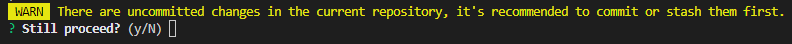
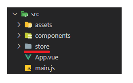
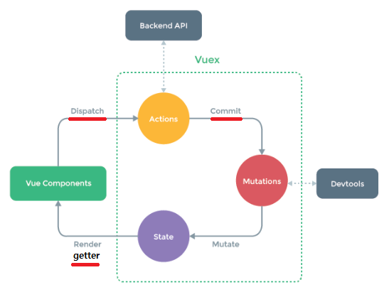
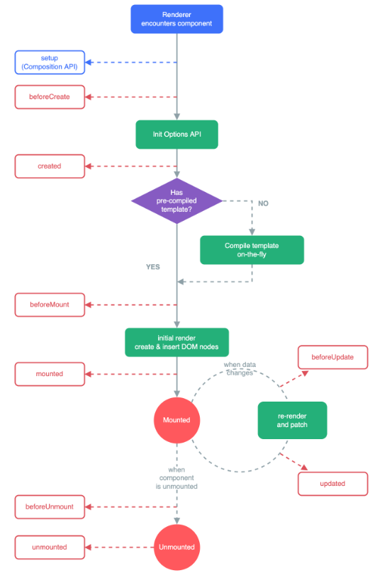

# Vue
## 221107 Vuex 기초 정리
### 목표
* Vuex 기초 정리
* lifecycle hook 정리


## state management 상태 관리
* 현재 app이 가지고 있는 data로 표현
* 각 component는 독립적이며, 각각의 data를 가짐
* 각각의 component가 같은 data로 유지하기 위해 상태 관리

### pass props, emit event
* 장점
* 같은 데이터를 공유
* 각 component가 동일한 상태 유지
* 데이터의 흐름 직관적으로 파악
* 단점
* component의 깊이가 깊어지면 데이터 전달이 어려움
* 공통의 상태를 유지해야하는 component가 많아지면 데이터 전달 구조가 복잡해짐

### centralized store
* 중앙 저장소에 데이터를 모아서 상태 관리
* 중앙 저장소의 데이터를 사용
* component 계층에 상관없이 중앙 저장소에 접근하여 데이터 관리
* 규모가 크거나 component 중첩이 깊어지는 경우에 관리가 용이 

## Vuex
* state management pattern + Library
* 중앙 저장소를 통해 상태 관리를 할 수 있는 라이브러리
* 데이터가 예층 가능한 방식으로만 변경 될 수 있도록 규칙을 설정
* Vue의 반응성을 효율적으로 사용하는 상태 관리 기능 제공
* 개발 환경에 맞게 vuex 와 pass props, emit event 사용
  * 중대형 규모의 SPA를 구축하는 경우 Vuex 사용 고려
* vue cli 에서 vuex plugin 설치
```
vue add vuex
```
* 
* 커밋 관련 y ㄱㄱ
* 
* store 디렉토리 생성
```javascript
import Vue from 'vue'
import Vuex from 'vuex'

Vue.use(Vuex)

export default new Vuex.Store({
  state: {
  },
  getters: {
  },
  mutations: {
  },
  actions: {
  },
  modules: {
  }
})
```

### state
* vue instance의 **data**에 해당
* <u>**중앙에서 관리하는 모든 상태 정보**</u>
* 각 component는 state에서 data에 접근하여 사용
* $store.state로 접근
* state의 데이터가 변화하면, 데이터를 사용하는 component 자동으로 렌더링

### mutations
* vue instance의 **methods**에 해당
* <u>**state를 변경**하기 위한 methods</u>
* mutatiosn에서 호출되는 핸들러 함수는 반드시 **동기적**
  * 비동기인 경우 state의 변화 시기 특정 불가
* 첫 번째 인자로 state
* component 혹은 actions에서 commit()으로 호출

### actions
* methdos역할 + **비동기** 작업을 포함
* <u>**비동기 작업을 포함하는 methods**</u>
* state 변경 이외의 모든 로직 수행
* state를 직접 변경하지 않고, **commit() 으로 mutations를 호출해 state 변경**
* 첫 번째 인자로 context 객체, 두 번째 인자로 payload
* **<u>context 객체</u>를 통해 <u>store.js의 모든 요소와 메서드에 접근</u> 가능**
* state를 직접 변경은 가능하지만 **지양**
* component에서 dispatch()로 호출

### mutations vs actions
* vue instance의 methods의 역할을
* vuex에서는 mutations 와 actions로 분화
* mutations : state 변경 기능
* actions : 그외 모든 기능

### getters
* vue instance의 **computed**에 해당
* <u>**state를 활용하여 계산한 새로운 변수 값**</u>
* state의 원본 데이터를 건드리지 않고, 계산된 값을 얻을 수 있음
* getters의 결과를 캐싱하고, 종속된 값이 변경된 경우에만 재계산
* state에 영향 x
* 첫 번째 인자로 state, 두 번째 인자로 getter

## 사용법


### state
* state: {} 에 저장할 data 작성 
* 작성한 data는 component에서 $store.state로 접근
* html에서 바로 출력하기보다 computed에서 캐싱한 후 사용
```javascript
// vuex

state: {
    msg: 'message',
}
```
```javascript
// component
// html에서 computed의 msg를 호출해서 사용

computed: {
    msg() {
        return this.$store.state.msg
    }
}
```

### actions
* component에서 dispatch()로 호출
```javascript
dispatch('actions 함수', payload(=넘겨주려는 data)){

}
```
* actions 함수는 context, payload를 인자로 받음
```javascript
functionName(context, payload(=넘겨받은 data)){

}
```
* dispatch로 또다른 actions 호출 가능
* context.store, context.getters 가능
* actions에서 state를 직접 조작은 지양
```javascript
// component
// html에서 changeMsg 호출 -> methods에 정의된 changeMsg 호출
// dispatch로 actions 에 정의된 함수 호출

methods: {
    changeMsg() {
        const newMsg = this.inputData
        this.$store.dispatch('changeMsg', newMsg)
    }
}
```
```javascript
// vuex

actions: {
    changeMsg(context, newMsg){
    
    }
}
```

### mutations
* component 또는 actions에서 commit() 으로 호출
```javascript
commit('mutations 함수', payload) {

}
```
* mutations 함수 구분을 위해 대문자로 작성
* mutations 함수는 state, payload를 인자로 받음
```javascript
functionName(state, payload) {

}
```
* mutations로 state를 변경
```javascript
// vuex

actions: {
    changeMsg(context, newMsg){
        context.commit('CHANGE_MESSAGE', newMessage) // mutations 함수 구분을 위해 대문자로 작성
    }
},
mutations: {
    CHANGE_MESSAGE(state, msg) {
        state.msg = msg
    }
}
```

### getters
* getters는 state를 활용한 새로운 변수
* computed에 캐싱한 후 사용
```javascript
functionName(state, getters) {
    }
```
* 다른 getter값 사용 가능
```javascript
// vuex

getters: {
    msgLength(state) {
        return state.msg.length
    },
    msgLengthSquare(state, getters){
        return getters.msgLength ** 2
    }
}
```
```javascript
// component 

computed: {
    msgLength() {
        return this.$store.getters.msgLength
    }
    msgLengthSquare() {
        return this.$store.getters.msgLengthSquare
    }
}
```

## Lifecycle Hooks
* vue instance의 생성과 소멸 과정 중 단계별 초기화 과정
  * ex) vue instance 생성될 때, DOM에 마운트될 때, 데이터가 변경되어 DOM 업데이트될 때
* instance마다 각각의 Lifecycle을 가짐
* 부모-자식 관계에 따른 순서를 가지고 있지 않음
* 컴포넌트별로 정의 가능
* 각 단계가 트리거가 되어 특정 로직 실행 가능
* 아래 그림의 빨간 부분에 코드 작성하여 자동 실행 가능

* 주로 created, mounted 를 많이 사용
* updated 사용시에는 무한루프에 빠질 수 있으므로 주의

### created
* vue instance가 생성된 후 호출
* data, computed 등의 설정이 완료된 상태
* **서버에서 받은 데이터를 vue instance의 data에 할당하는 로직 구현에 적합**
* 아직 mount 되지 않아서 접근은 불가

### mounted
* vue instance가 DOM의 요소에 mount된 후 호출
* mount된 요소 조작 가능

### updated
* 데이터가 변경되어 DOM에 변화를 줄 때 호출

## Local Storage
* 브라우저의 local storage에 저장하면, 브라우저를 새로고침하여도 데이터가 보존

### Window.localStorage
* 브라우저에서 제공하는 저장공간
* 브라우저를 종료하고 다시 실행해도 만료되지 않고 데이터가 보존
* 데이터를 문자열 형태로 저장
* setItem(key, value)
  * key, value 형태로 데이터 저장
* getItem(key)
  * key에 해당하는 데이터 조회

### vuex-persistedstate
* Vuex state를 자동으로 브라우저의 local storage에 저장해주는 라이브러리
* 페이지가 새로고침 되어도 vuex state를 유지 및 자동으로 state 불러오기
```
$ npm i vuex-persistedstate
```
* 플러그인에 createPersistedState 추가
```javascript
// index.js

import createPersistedState from 'vuex-persistedstate'

Vue.use(Vuex)

export default new Vuex.Store({
  plugins: [
    createPersistedState(),
  ],
  ...
})
```