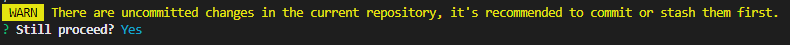
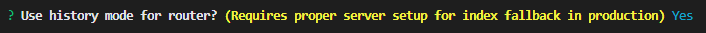
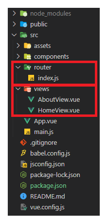
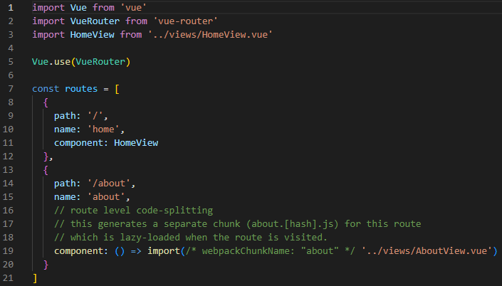
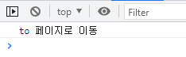
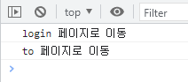

# Vue
## 221109 vue router 정리
### 목표
* vue router 작성 방법 익히기


## UX User Experience
* 유저가 느끼는 느낌, 태도, 행동을 디자인
* 데이터를 기반으로 유저를 조사하고 분석해서 개발자, 디자이너가 이해할 수 있게 소통
* 유저 리서치, 데이터 설계 및 정제, 유저 시나링, 프로토타입 설계

## UI User Interface
* 유저에게 보여지는 화면을 디자인
* UX를 고려한 디자인 반영
* 심미적으로 보기 예쁜 디자인 뿐만 아니라
* 사용자가 쉽고 편리하게 사용할 수 있도록 고려
* 통일된 디자인을 위한 시스템, 소통을 위한 중간 산출물, 프로토타입

## Routing
* 네트워크에서 경로를 선택하는 프로세스
* 웹 서비스에서의 라우팅
* 유저가 방문한 url에 맞게 응답

### SSR 에서의 routing
* 서버가 모든 라우팅을 통제
* url로 요청이 들어오면 요청에 맞는 완성된 html을 응답

### CSR/SPA 에서의 routing 
* 서버가 하나의 html만을 제공, 그 위에 javascript로 작성
* **하나의 url만을 가질 수 있음**
* 즉 동작에 따라 url이 바뀌지않고 하나로 고정되어 버림
* 사용성 관점에서는 동작에 따라 url이 바뀌는 것이 좋음
  * 유저가 url을 통해 페이지의 변화 감지
    * 무엇을 렌더링 중인지 상태 파악
    * 새로고침, 링크 공유를 통해 들어오면 첫 페이지 최상단으로 이동
  * 브라우저의 뒤로가기 기능
    * 이전 url로 이동
* 그래서 router를 이용하여 single page에서의 routing을 구현

## Vue Router
* SPA에서의 routing 개발 기능 제공
* routes에 component를 매핑하여 어떤 url에서 렌더링 할지 설정
* MPA처럼 url을 이동하면서 사용할 수 있게 해결
```
$ vue add router
```



* 커밋 관련, y ㄱㄱ



* history mode 사용, y ㄱㄱ

### history mode
* 브라우저의 History API를 활용하여 **새로고침 없이 url 이동 기록을 남김**
* / 를 사용한 url 구조 사용
* history mode를 사용하지 않으면 hash mode로 설정
* \# 을 사용한 url 구조 사용

### router 관련 변경



* router, view 생성



* 각 component 별로 url 매핑
* django에서의 urls.py 의 역할

### router-link 태그
* url을 이동 기능
* to="" 속성으로 경로 지정
* routes에 등록된 component와 mapping 
* history mode에서 router-link는 클릭 이벤트 차단
* a 태그와 비슷한 기능, 하지만 브라우저가 페이지를 다시 로드하지 않도록 함

### router-view 태그
* url과 매핑된 component를 렌더링 하는 component
* DOM에 부착되어 보이는 자리
* django에서 block 태그 와 비슷한 역할
* App.vue 는 base.html
* router-view 는 block 태그 공간

### src/views
* router와의 연결 유무로 component 작성 위치 분리
* 기능상 차이x
* router와 직접적으로 연결된(mapping된) component 작성
* router-view에 렌더링 되는 component들 
* 이름이 View로 끝나도록 작성 권장
* 연결되지 않은 component는 기존의 src/components 에 작성

### vue-router
* 주소를 이동하는 방법
  1. 선언적 방식 네비게이션
  2. 프로그래밍 방식 네비게이션

### 선언적 방식 네비게이션
* router-link의 to="" 속성 사용
* index.js 의 routes 배열에 매핑된 component로 이동
```html
  <router-link to="/">Home</router-link> |
  <router-link to="/about">About</router-link>
```
* v-bind 와 name 키를 사용하여 동적으로 사용 가능
```html
  <router-link :to="{ name: 'home' }">Home</router-link> |
  <router-link :to="{ name: 'about' }">About</router-link> |
```

### 프로그래밍 방식 네비게이션
* $router 로 라우터 인스턴스에 접근
* this.$router.push 로 객체 추가하여 이동할 url 설정
* history stack 에 이동할 url을 push
* history tack에 기록이 남기 때문에 이전 url로 이동하는 뒤로 가기 기능 가능
```html
  <button @click="toHome">Home</button>
```
```javascript
  methods: {
    toHome() {
      this.$router.push({ name: 'home'})
    },
  }
```
* dynamic route matching 동적 인자 전달
* url 주소에 변수 사용 가능
* django 의 variable routing
* index.js 에서 component import 및 routes 에 url 정보 객체 저장
* : 으로 변수 표시
```javascript
import HelloView from '@/views/HelloView'

const routes = [
  {
    path: '/hello/:userName',
    name: 'hello',
    component: HelloView,
  },
]
```
* component에서 data에 저장해서 사용
* $route 으로 접근
```html
  <h1>{{ userName }}</h1>
```
```javascript
  data() {
    return {
      userName: this.$route.params.userName
    }
  }
```
* parmas 키를 이용해서 동적 인자 전달
```html
  <button @click="toHome">Home</button>
```
```javascript
  methods: {
    toHome() {
      this.$router.push({ name: 'home', params: { useName: this.userName }})
    },
  }
```

### lazy-loading
* html 페이지에서 모든 파일을 미리 loading하지 않고
* 특정 라우트에 방문할 때, 매핑된 컴포넌트를 로드하는 방식
* 모든 파일을 한 번에 loading 하지 않아 최초 로딩 시간 빠름
* 나중에 사용할 component는 나중에 load
* component에 화살표 함수로 작성
```javascript
const routes = [
  {
    path: '/',
    name: 'home',
    component: HomeView
  },
  {
    path: '/about',
    name: 'about',
    // route level code-splitting
    // this generates a separate chunk (about.[hash].js) for this route
    // which is lazy-loaded when the route is visited.
    component: () => import(/* webpackChunkName: "about" */ '../views/AboutView.vue')
  },
]
```

## Navigation Guard
* vue router를 통해 특정 url로 접근할 때,
* 다른 url로 redirect 하거나 해당 url로의 접근을 막는 방법
* ex) 로그인 필요 기능
* 종류
  * 전역 가드 : 앱 전역에서 동작
  * 라우터 가드 : 특정 url에서만 동작
  * 컴포넌트 가드 : 라우트 컴포넌트 안에 정의

### Global before Guard 전역 가드
* **다른 url 주소로 이동할 때 항상 실행**
* index.js 에서 router 정의 이후에 작성
* router.beforeEach(to, from, next)
* 전역 가드는 콜백 함수
* to : **이동할 url** 정보가 담긴 route <u>객체</u>
* from : **현재 url** 정보가 담긴 route <u>객체</u>
* next : **지정한 url**로 이동하기 위해 호출하는 <u>함수</u>
  * 콜백 함수 beforeEach 내부에 **next()는 반드시 한 번만 호출**
  * default 는 to에 해당하는 url로 이동
* url이 변경되어 화면이 전환되기 전에 router.beforeEach() 호출
* 변경된 url로 라우팅하려면 next() 호출
* next()가 호출되기 전까지 화면이 전환되지 않고 대기 상태 유지
```javascript
// router/index.js

const router = new VueRouter({
  mode: 'history',
  base: process.env.BASE_URL,
  routes
})

// 전역 가드
// 위의 router 정의 이후에, 전역 가드 작성
router.beforeEach((to, from, next) => {

  const isLogin = false             // 로그인 상태, 백엔드에서 로그인 상태에 관한 정보 받아오기
  
  const authPages = ['hello', 'about']       // 로그인이 필요한 페이지

  const isAuthRequired = authPages.includes(to.name)    // 로그인 필요 여부

  if (isAuthRequired && !isLogin) {
    console.log('login 페이지로 이동')
    next({ name: 'login' })         // 로그인 필요 && 로그 아웃 상태 이면, 로그인 페이지로
  } else {
    console.log('to 페이지로 이동')
    next()                          // default 는 to 로 이동
  }
})
```
* 로그인 상태일 때
* 
* 로그아웃 상태일 때
* 
* 첫 번째 출력은 authPages 로 들어갈 때 전역 가드
* 두 번째 출력은 전역 가드에 의해 login 으로 보내진후, login 으로 들어갈 때 전역 가드


### Router Guard 라우터 가드
* 특정 route 에 대해서만 가드를 설정 할 때
* beforeEnter(to, from, next)
* **route에 진입했을 때 실행**
* 라우터를 등록한 위치에 작성
* 같은 페이지에서 매개변수, 쿼리, 해시 값이 변경될 때는 실행x
* 다른 경로에서 탐색할 때만 실행
```javascript
// router/index.js

const routes = [
  {
    path: '/login',
    name: 'login',
    component: LoginView,
    
    // 라우터 가드
    // 해당 라우터 객체 안에서 라우터 가드 작성
    beforeEnter(to, from, next) {
      const isLogin = true
      
      if (isLogin) {                  // 로그인 상태에서 로그인 페이지로 들어오 것 방지
        console.log("로그인 상태")
        next({ name: 'home' })        // 로그인 후 home으로 이동
      } else {
        console.log("로그아웃 상태")
        next()                        // 로그아웃 상태면 to로 진행
      }
    }
  },
]
```

### Component Guard 컴포넌트 가드
* 특정 컴포넌트 내에서 가드를 설정 할 때
* beforeRouteUpdae(to, from, next)
* 해당 컴포넌트를 렌더링하는 경로가 변경될 때 실행
* parmas 변화 감지
```javascript
// views/HelloView.vue

<script>
  export default {
    name: 'HelloView',
    data() {
      return {
        userName: this.$route.params.userName,
      }
    },

    // 컴포넌트 가드
    // 해당 컴포넌트에 작성
    beforeRouteUpdate(to, from, next) {
      this.userName = to.params.userName    // params의 변화 업데이트
      next()
    }
  }
</script>
```

## 404 Not Found
* 사용자가 요청한 리소스가 존재하지 않을 때의 응답
* 

### router 에서 porps, emit
* props는 router 에서 props 속성 사용
  * https://v3.router.vuejs.org/guide/essentials/passing-props.html#boolean-mode
* <router_view/> 에서 props, emit 처리하기
```html
<router_view/ :passProps="propsData" @emitEvent="catachEvent">
```

### @click.native
* vue에서 제공하는 태그는 @click.native=""  .native를 붙여줘야 함
* 일반 html 태그는 @click="" 그냥 사용 가능

### 동영상 관련 tag
* iframe 태그

### youtube api
* https://developers.google.com/youtube/v3/getting-started
