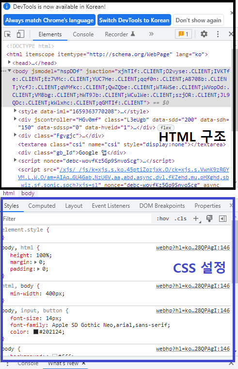
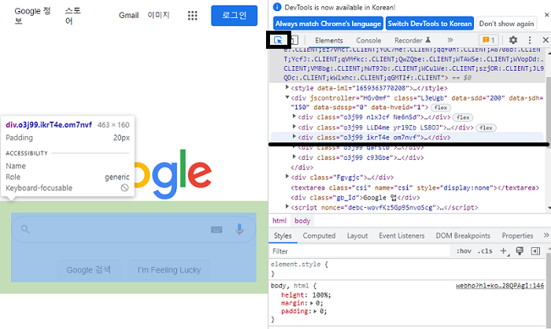
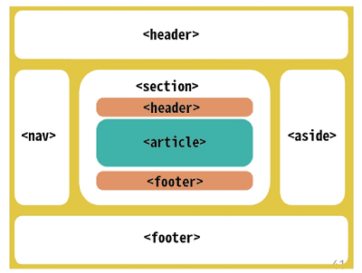
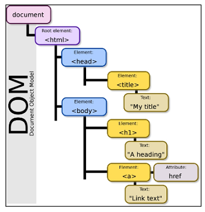

# web
## 220801 html
### 목표
* html 기초 및 사용법 익히기


### web 공부하기
* 브라우저 별로 결과가 다른 케이스가 있다...
* 최대한 많은 웹사이트를 보고 클론코딩 해보는게 답
* 시각적 결과를 보면서 어떻게 적용되는지 많이 겪어보기

### 개발 환경
* vscode 확장자 다운
  * open in browser
  * auto rename tag
  * highlight matching tag
* 크롬 사용
  * f12 로  개발자 도구 켜기
  * 혹은 오른쪽 클릭 검사

* 개발자 도구
* 
* elments : DOM탐색 , CSS 확인 수정
  * styles : 요소에 적용된 CSS 확인
  * computed : 스타일이 계산된 최종 결과
  * event listeners : 요소에 적용된 이벤트 (JS)
  * 위는 html 구조
  * 아래는 css 설정
  
### web
#### 웹 사이트의 구성 요소
* 웹 사이트 : 브라우저를 통해 접속하는 웹 페이지(문서)들의 모음
* html : 구조
* css : 표현
* javascript : 동작 처리 계산

#### browser 브라우저
* 웹 사이트는 브라우저를 통해 동작
* 브라우저마다 동작이 달라서 문제가 발생 (파편화)
  * IE 브라우저 : deprecated 더이상 사용하지 않고 대체 되었다
* 웹 표준이 등장

#### 웹 표준
* 웹에서 표준적으로 사용되는 기술, 규칙
* cross browsing : 어떤 브라우저에서든 웹 페이지가 동일하게 보이도록 함
* [can i use](https://caniuse.com/)
  * 브라우저 별로 기술이 사용가능한지 아닌지 확인 가능


### HTML
* Hyper Text Markup Language
* 태그를 이용하여 웹 페이지를 구조화하여 브라우저로 실행하는 문서
* .html

* Hyper Text
  * 참조(하이퍼링크)를 통해 사용자가 한 문서에서 다른 문서로 즉시 접근할 수 있는 텍스트
* Markup Language
  * 태그 등을 이용하여 문서나 데이터의 구조를 명시하는 언어
  * HTML, Markdown

* 스타일 가이드
```html
<!DOcTYPE html>
<html lang="en">
<head>
  <meta charset="UTF-8">
  <title> 가이드 </title>
</head>
<body>
  <h1> 웹문서 </h1>
  <ul>
    <li>HTML</li>
    <li>CSS</li>
  </ul>
</body>
```
* **indentation 는 두 칸** (space 두 번)

#### 기본 구조
* html : 문서의 최상위(root) 요소
* head : 문서 **<u>메타데이터</u>** 요소
  * **<u>문서 제목, 인코딩, 스타일, 외부 파일 로딩</u>** 등
  * 일반적으로 브라우저에 나타나지 않는 내용
* body : 문서 본문 요소
  * **<u>실제 화면</u>** 구성과 관련된 내용

#### head
* \<title> : 브라우저 상단 타이틀
* \<meta> : 문서 레벨 메타데이터 요소
* \<link> : 외부 리소스 연결 요소 (CSS파일, favicon 등)
* \<script> : 스크립트 요소 (JavaScript 파일 코드)
* \<style> : CSS 직접 작성
* Open Graph Protocol
  * 메타 데이터를 표현하는 규약
  * 메타 데이터에 해당하는 제목, 설명 등을 쓸 수 있도록 정의
  * ex) 썸네일

#### element 요소
* \<tag>contents\</tag>
* 시작태그로 열고 컨텐츠 작성 종료태그로 닫기
* 태그로 정보의 성격과 의미 정의
* 요소의 중첩(nested)으로 문서를 구조화
* 오류가 반환되지 않고, 레이아웃이 깨진 상태로 출력
* 개발자 도구로 확인해보자


#### attribute 속성
```html
<a href="https://google.com"></a>
```
* href: 속성명, "contents" : 속성값
* 태그별로 사용할 수 있는 속성이 다르다
>주의!!!
* href="https://google.com"
  * **= 사용시 공백없이 작성** 
  * **" " 쌍따옴표 사용**
* 속성을 통해 태그의 부가적인 정보(경로, 크기 등) 설정
* 요소의 시작 태그에 작성, 이름과 값이 하나의 쌍으로 존재
* HTML Global Attribut
  * 모든 요소가 공통으로 사용할 수 있는 속성

|속성|의미|
|:---|:---|
|id|고유 식별자 지정|
|class|공백으로 구분된 요소의 클래스 목록 (css, js에서 요소 선택 접근)|
|data-*|개인 사용자 정의 데이터 저장|
|style|inline 스타일|
|title|요소에 대한 추가 정보 지정|
|tabindex|요소의 탭 순서|

#### 시멘틱 태그
* HTML5 에서 추가된 의미를 담은 태그
* 의미를 가지는 태그를 사용해 가독성을 높이고 유지보수가 용이
* 
* header : 헤더, 문서나 섹션의 머리말
* nav : 내비게이션
* aside : 사이드 공간, 메인과 관련성이 적은 컨텐츠
* section : 구분, 컨텐츠의 그룹 표현
* article : 독립적으로 구분되는 영역
* footer : 푸터, 마지막 부분

#### rendering 렌더링
* 코드를 우리가 보는 웹 사이트 결과물로 바꾸는 과정

#### DOM (Document Object Model) 트리
* 
* 브라우저에 렌더링 하기 위한 구조
* HTML 문서에 대한 모델 구성
* HTML 문서 내의 각 요소에 접근, 수정에 필요한 프로퍼티와 메서드 제공


### HTML 문서 구조화
#### inline/block 인라인/블록 요소
* 인라인 : 하나의 페이지에서 **일부**, 글자처럼 취급    
* 블록 : 하나의 페이지에서 **한줄 전체**

#### 텍스트 요소
|태그|의미|
|:---|:---|
|\<a>\</a>|href 속성으로 url연결하는 하이퍼링크 생성|
|\<b>\</b>|굵은 글씨 표현, bold|
|\<strong>\</strong>|\<strong>은 시멘티 태그, strong|
|\<i>\</i>|기울임 표현, italic|
|\<em>\</em>|\<em>은 시멘틱 태그, emphasis|
|\<br>|줄 바꿈 생성|
|\|src 속성으로 이미지 표현|
|\<span>\</span>|의미 없는 인라인 컨테이너|

#### 그룹 컨텐츠
|태그|의미|
|:---|:---|
|\<a>\</a>|paragraph 하나의 문단|
|\<hr>|Horizontal Rule 수평선 표현|
|\<ol>\</ol>|orderd 순서가 있는 리스트|
|\<ul>\</ul>|unorderd 순서가 없는 리스트|
|\<pre>\</pre>|HTML 작성 내용 그대로 표현, 고정폭 글꼴사용 공백문자 유지|
|\<blockquote>\</blockuote>|들여쓰기 표현|
|\<div>\</div>|의미 없는 블록 컨테이너|

#### form (매우 중요!!)
* \<form>은 데이터를 서버에 제출하기 위해 사용하는 태그
  * ex) 로그인 id\pw 정보
* action : 데이터를 보낼 곳
* method : 데이터를 전송하기위한 방법, get 형식 post 형식
* enctype : post 형식일 때, 암호화
  * application/x-www-form-urlencoded : 기본값
  * multipart/form-data : 파일 전송시

#### input
* 입력 데이터 유형과 위젯 제공
* input에 직접적인 내용
* name : 이름 (이름/값 쌍으로 전송)
* value : 값
* required, readonly, autofocus, autocomplete, disable 

```html
<form action="/search" method="GET">
  <input type="text" name="q">
</form>
```
* https://www.google.com/search?q=HTML
* form을 통하여 input의 내용을 search기능으로 구글에 요청

#### input label
* \<input>에는 id 속성, \<label>에는 for 속성 작성, id-for 연결
# ppt 예시 따라 해보기
* [input 유형](https://developer.mozilla.org/ko/docs/Web/HTML/Element/Input)
* text : 일반 텍스트 입력
* password : 비밀번호 입력, 값이 보이지 않고 * 로 표현
* email : 이메일, 이메일 형식이 아니면 form 제출 불가
* number : 숫자, min, max, step 으로 숫자 범위 설정
* file : 파일, accept 으로 파일 타입 지정
* checkbox : 다중 선택
* radio : 단일 선택
* color : 색 color picker
* date : 날짜 date picker
* hidden : 사용자에게 보이지 않는 input


* 예시
```html

```
1. form 부터 작성
2. input 제출 작성
3. 이후 input 세부 내용 작성

# 예제 따라해보기