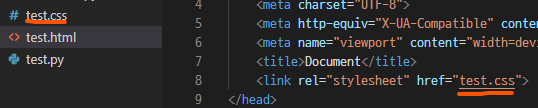

# web
## 220801 220802 css
### 목표
* css 기초 및 사용법 익히기


### CSS
* Cascading Style Sheets
* html 요소를 선택자로 선택하고, 스타일을 지정
* 자주 쓰는 속성 30 ~ 40개 정도는 숙지
```css
h1{
    color: blue;
}
```
* selertor 선택자 : 선택자로 h1 선택
* property 속성 : color
* value 값 : blue

#### 정의방법
* inline 인라인 : \<h1 style="color: blue;">
* embedding 내부참조 : \<style> 작성 \</style>
* **<u>link file 외부참조</u>** : 
  * 
  * .css파일 따로 만들기
  * link에서 .css파일 참조
  * 가장 많이쓰는 방법

### [★ CSS selector 연습하기](https://flukeout.github.io/)

### CSS selectors (중요!!)
* 기본 선택자
  * 전체 선택자, 요소 선택자
  * 클래스 선택자, 아이디 선택자, 속성 선택자
* 결합자 combinators
  * 자손 결합자, 자식 결합자
  * 일반 형체 결합자, 인접 형체 결합자
* 의사 클래스/요소 psedo class
  * 링크, 동적 의사 클래스
  * 구조적 의사 클래스, 기타 의사 클래스, 의사 엘리먼트, 속성 선택자

```css
/* 전체 선택자 */
* {
    color: black;
}

/* 요소 선택자 */
h1, h2 {
    color: gray;
}

/* 클래스 선택자 */
.classname {
    color: violet;
}

/* id 선택자 */
#idname {
    color: coral
}

/* 자식 결합자 */
.div > p {
    color: aquamarine;
}

/* 자손 결합자 */
.div p {
    color: beige;
}
```
* \* {} : 전체 선택자
* h1 {} : 요소 선택자
  * 태그를 선택
* .classname {} : class 선택자
  * classname에 해당하는 항목 선택
* #idname {} : id 선택자 
  * id에 해당하는 항목 선택
  * id는 중복x 권장
* .div > p {} : 자식 결합자 
  * 부모의 바로 다음 자식 p
* .div p {} : 자손 결합자 
  * 부모의 자손들 모두 p

### CSS 적용 우선순위 (매우 중요!!!)
1. !Important
2. Inline Style
3. id 선택자
4. class 선택자, 속성, pseudo-class
5. 요소 선택자, pseudo-element
6. css 파일 소스 순서

### CSS 상속 (헷갈림 주의!!!)
* 부모 요소의 속성을 자식에게 상속
* 상속이 되는 것
  * text 요소 : font, color, text-align ...
  * opacity, visibility
* 상속 되지 않는 것
  * box model 요소 : width, length, margin, padding, border ...
  * position 요소 : position, top, right, bottom, left ...

* 모르는건 mdn 에서 검색!

### CSS 스타일
#### 크기 단위
* px : 픽셀
  * 모니터 해상도 픽셀 기준
  * 고정 단위
* % : 배율
  * 백분율 단위
  * 가변 레이아웃에 사용
* em : 부모의 배수
  * 부모 요소를 기준으로 배수
  * 상속에 영향o
  * 상대적인 사이즈 필요시 사용
* rem : 최상(root)의 배수
  * 최상위 요소 html의 사이즈를 기준으로 배수
  * 상속에 영향x


#### viewport
* 사용자가 웹을 볼 때 보게되는 디바이스 화면상의 영역
* 디바이스의 viewport를 기준으로 상대적인 사이즈 적용
* vw, vh, vmin, vmax
* px vs vw
* 
* 
  * px : 고정 값으로 브라우저의 크기가 변해도 그대로
  * vw : 상대 값으로 브라우저의 크기에 따라 변함

#### 색상 단위
* background-color : red;
  * 글자로 표기
* background-color : rgb(0, 255, 0);
  * rgb(값), #16진수로 표기
* background-color : rgba(0, 255, 0, 0.7);
  * a : alpha 투명도
* background-color : hsl(0, 100%, 50%);
  * 색상, 채도, 명도로 포현

#### 표현
* text
  * font-family, font-style, font-weight
  * letter-spacing, word-spacing, line-height
* color
  * background-color, background-image
* li
* table

* 모르는건 mdn 검색

### 결합자
* div span {} : 자손 결합자
  * div(부모) 아래의 모든 span(해당 자식) 요소
* div > span {} : 자식 결합자
  * div(부모) 아래의 첫째 span(자식) 요소만 해당
  * 손자x
* p ~ span {} : 일반 형제 결합자
  * p 뒤에 위치하는 모든 span(형제) 요소
* p + span {} : 인접 형제 결합자
  * p 바로 뒤에 위치하는 span(형제) 요소

***
## CSS 원칙 (중요!!)
### * box model : 모든 요소는 박스모델로 이루어져 있다
### * normal flow : 위에서 부터 아래로, 왼쪽에서 오른쪽으로 (좌측 상단부터) 쌓인다
### * display에 따라 box의 크기와 배치가 달라진다
### * position으로 box의 이동 기준을 변경
***

#### box model
* margin
  * 테두리 바깥의 외부 여백
  * 배경색 지정 불가
* border
  * 테두리 영역
* padding
  * 테두리 안쪽의 내부 여백
  * 요소의 배경색, 이미지 적용
* content
  * 요소의 실제 내용 (글, 이미지)

#### shrorthand
* margin/padding의 shorthand는 위, 오른쪽, 아래, 왼쪽 순서로 구성(시계방향)
```css
/* 상하 10px , 좌우 20 px */
.margin-1{
    margin: 10px 20px;
}

/* 상 10px , 우 20px , 하 30px , 좌 40px*/
.margin-2{
    margin: 10px 20px 30px 40px;
}
```
* border shorthand로 한줄 표현
```css
.border{
  border: 2px solid black;
}
```

#### box sizing (헷갈림 주의)
* 기본설정은 box size는 순수한 content 영역의 크기
  * box-sizing: content-box;
* 하지만 실제로 화면을 볼 때는,,,
* border를 기준으로 하는 것이 직관적이다!
* 이 경우 box-sizing 변경
  * box-sizing: border-box;
* 비교
* 
```css
box-sizing: content-box;
width: 100%;
```
* 
```css
/* content가 기준이라 튀어나온다! */
box-sizing: content-box;
width: 100%;
border: solid #5B6DCD 10px;
padding: 5px;
```
* 
```css
/* border-box로 변경하면 된다! */
box-sizing: border-box;
width: 100%;
border: solid #5B6DCD 10px;
padding: 5px;
```

---
기본은 content가 기준
하지만 보편적으로 시각적으로 boder를 기준으로 하고 싶음
box-sizing: "border-box" 변경하기 

### display
* display: block;
  * 블록 요소로 display
  * margin-right, margin-left
* display: inlin;
  * 인라인 요소로 display
  * width, height, margin 지정 불가
  * 대신 여백은 line-height 으로 지정
  * text-align
* display: inline-block;
  * 블록과 인라인 요소의 특징을 모두 가진다
  * 인라인처럼 한줄에 표시
  * 블록처럼 width, height, margin 속성 지정 가능
* display: none;
  * 화면에 공간 부여 x
  * 화면에 표시 x
  * visibility: hidden; 과 비교하면
    * 화면에 공간은 차지하지만, 표시만 하지 않음

### postion
* 요소의 위치를 지정
* static (default)
  * normal flow를 따르는 배치
  * 자식은 부모의 위치를 기준으로 배치
* 속성
  * relative
  * absolute
  * fixed
  * sticky

* relative : 상대 위치
  * 기존의 static 위치를 기준으로 이동
  * normal flow 유지
  * normal position 대비 offset을 가진다
* absolute : 절대 위치
  * static이 아닌 가장 가까운 부모 요소를 기준으로 이동
  * 해당되는 부모 요소가 없는 경우 브라우저 화면을 기준으로 이동
  * 레이아웃에 공간을 차지하지 않음
  * normal flow를 벗어남
* fixed : 고정 위치
  * viewport 기준으로 이동 후 고정
  * 스크롤 이동 시에도 고정
  * 레이아웃에 공간을 차지하지 않음
  * normal flow를 벗어남
* sticky : 기본 static에서 스크롤이 움직이면 fixed
  * 평소에는 static과 같은 position
  * 스크롤이 이동하면 fixed position

* position 비교
* 
```html
position: static;
```
* 
* 기존의 위치에서 40px 만큼 이동
```html
position: relative;
top 40px;
left 40px;
```
* 
* 부모요소가 없을 때는, 브라우저 화면을 기준으로 40px 만큼 이동
```html
position: absolute;
top 40px;
left 40px;
```
* 
* 스크롤이 내려와도 화면에 고정
```html
position: sticky;
top: 20px;
```

### 개발자 도구 활용하기!!
* https://developer.chrome.com/docs/devtools/css/

### emmet
* 단축키, 약어 등을 사용하여 빠르게 문서 작성
* cheat-sheet 확인하기
* https://docs.emmet.io/cheat-sheet/