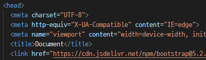
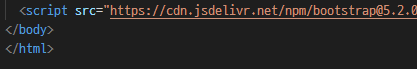
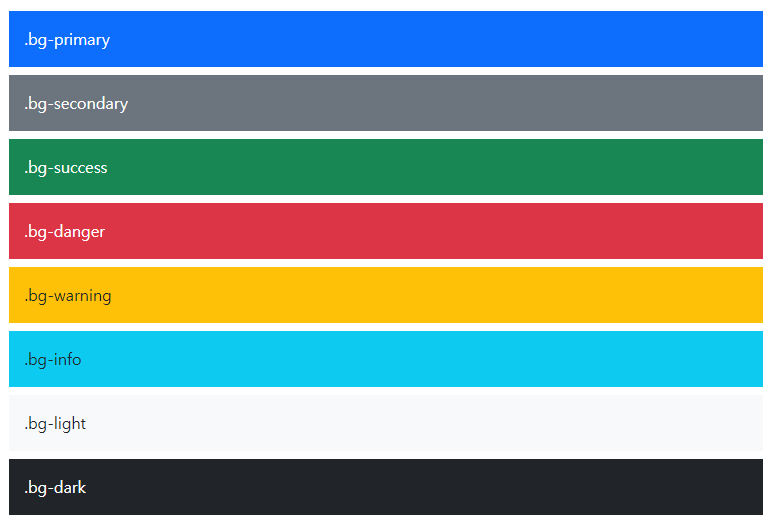
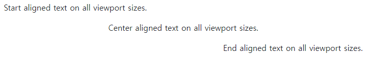
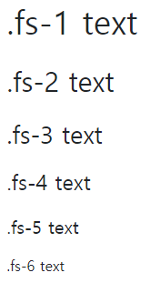
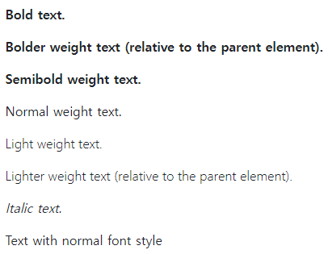

# web
## 220803 220804 그리드 시스템 / 반응형 웹
### 목표
* flex box 사용법을 익히고 연습
* 그리드 시스템 / 반응형 웹 구현 


### CSS layout
* normal flow : 좌측 최상단부터 쌓인다
* normal flow를 벗어나서 내가 원하는대로 배치하고 싶음

#### Float
* 글 중간에 사진을 넣을 수 없을까?
* float
  * 박스를 왼쪽/오른쪽으로 이동
  * 인라인 요소들이 주변을 감싸도록 함

  * 
  * **float: none;** (default)
  * 
  * **float: left;** 
  * 요소를 왼쪽으로
  * 
  * **float: right;** 
  * 요소를 오른쪽으로

* clear
  * float을 clear시켜서, floating element 근처를 비우도록 배치
  * 
  * **clear: none;**
  * 
  * **clear: left;** 
  * left에 위치한 요소의 float을 clear
  * 
  * **clear: right;** 
  * right에 위치한 요소의 float을 clear
  * 
  * **clear: both;**
  * 양쪽 모두에 위치한 요소의 float을 clear

### Flexbox
* row, column 형태로 아이템들을 배치하는 1차원 레이아웃
* main axis : 메인 축
* cross axis : 교차 축
* flex container : 부모 요소
* flex item : 자식 요소
* 주의!! : 부모 요소인 flex container에 display: flex 적용!!
```css
/* 부모 요소에 적용!! */
.flex-container {
  display: flex;
}
```

#### flex 속성
* 배치 설정   
  * flex-direction
  * flex-wrap
* 공간 나누기
  * justify-content 
    * main axis 방향의 공간 설정
  * algin-content 
    * cross axis 방향의 공간 설정
* 정렬
  * align-items
    * cross axis 방향으로 모든 아이템 정렬
  * align-self
    * cross axis 방향으로 개별 아이템 아이템

#### 배치설정
* flex-direction
  * row (default)
  * row-reverse
  * column
  * column-reverse
* main axis 방향 설정
* 

* flex-wrap
  * wrap
  * wrap-reverse
  * nowrap (default)
* 아이템이 컨테이너 영역을 벗어나지 않도록 배치, 줄바꿈
* 

* flex-flow
* flex-direction 과 flex-wrap 을 순서대로 작성하는 shorthand
```css
flex-flow: column wrap-reverse;
```

#### 공간 나누기
* justify-content
* <u>**main axis 방향**</u>의 공간 설정
* 

* align-content
* <u>**cross axis 방향**</u>의 공간 설정
* 

* flex-start
* flex-end
* center
* space-between : 양끝 위치후, 남은 공간 균등 분배
* space-around : item하나의 주변 공간을 같게
* space-evenly : item간의 간격을 균등하게

#### 정렬
* align-items
* <u>**cross axis 방향**</u>으로 <u>**모든**</u> 아이템 정렬
* 

* align-self
* <u>**cross axis 방향**</u>으로 <u>**모든**</u> 아이템 정렬
* 

* stretch (default) : 컨테이너를 가득 채움
* flex-start
* flex-end
* center
* baseline : 텍스트 baseline에 기준선을 맞춤


#### 기타
* flex-grow : 남은 영역에 아이템 분배
  * flex-container 내부에서 grow값 만큼 공간을 할당
  * 모두 동일하다면 
```css
flex-grow: 1;
```
* order : 배치 순서
  * order값의 순서대로 item 배치 (오름차순)
  * 설정 안하는 경우 default는 0
  * 하나만 -1로 설정해서 맨 앞으로 가져올 수 있음
```css
order: -1;
```


### Bootstrap
* CDN via jsDelivr
  * Content Delivery(Distribution) Network
  * 여러 노드에 가진 네트워크에 데이터를 제공하는 시스템
* [bootstrap](https://getbootstrap.com/docs/5.2/getting-started/download/)
* 사용 방법
* head에 \<link>추가
* \<body> 바로 위에 \<script>추가
* 
* 

***
## 공식 문서에서 찾기!!
### [Bootstrap docs](https://getbootstrap.com/docs/5.2/getting-started/introduction/)
### 자주 쓰는 것들만 숙지하고,
### 나머지는 공식 문서에서 찾아서 쓰기
### 연습 많이 해보기!
***

#### spacing
* margin padding 을 설정
* {property}{sides}-{size}
```html
<div class="mt-3 ms-5">bootstrap-sapcing</div>
```
* class에 바로 사용
* margin, top, 3rem
* margin, start, 5rem

* property
  * m : margin
  * p : padding
* sides
  * t : top
  * b : bottom
  * s : start (right)
  * e : end (left)
  * x : x축 
  * y : y축
  * blank : 4방향 다
* size:

|size|rem|px|
|:--|:--|:--|
|0|0|margin/padding 적용 x|
|1|0.25 rem|4px|
|2|0.5 rem|8px|
|3|1 rem|16px|
|4|1.5 rem|24px|
|5|3 rem|48px|
|auto|자동설정|

#### color
* 

#### text
* text alignment
  * 
```html
<p class="text-start">Start aligned text on all viewport sizes.</p>
<p class="text-center">Center aligned text on all viewport sizes.</p>
<p class="text-end">End aligned text on all viewport sizes.</p>
```

* font size
  * 
  * fs-1이 가장 크다
```html
<p class="fs-1">.fs-1 text</p>
<p class="fs-2">.fs-2 text</p>
<p class="fs-3">.fs-3 text</p>
<p class="fs-4">.fs-4 text</p>
<p class="fs-5">.fs-5 text</p>
<p class="fs-6">.fs-6 text</p>
```

* font weight , style
  * 
```html
<p class="fw-bold">Bold text.</p>
<p class="fw-bolder">Bolder weight text (relative to the parent element).</p>
<p class="fw-semibold">Semibold weight text.</p>
<p class="fw-normal">Normal weight text.</p>
<p class="fw-light">Light weight text.</p>
<p class="fw-lighter">Lighter weight text (relative to the parent element).</p>
<p class="fst-italic">Italic text.</p>
<p class="fst-normal">Text with normal font style</p>
```

#### position
#### Display

### components
#### button
#### dropdown
#### navbar
#### carousel
#### modal
### forms
#### form control
### flexbox

### Responsive Web Design 반응형 웹
### bootstrap grid system (매우 중요)
#### grid system
#### breakpoints
#### grid system breakpoints